# Paper-Essence 论文精华推送工作流搭建教程

## 📖 项目简介

**Paper-Essence** 是一个基于 Dify 平台搭建的自动化论文推送工作流。该工作流能够：

- 🕐 每天定时从 ArXiv 获取指定研究领域的最新论文
- 🤖 使用大模型智能筛选出最有价值的论文
- 📄 通过 OCR 解析论文 PDF，提取关键技术细节
- 📧 生成结构化的论文日报并通过邮件自动推送

GitHub 仓库：https://github.com/LiaoYFBH/PaperFlow，您可直接导入 `prj\Paper-Essence-CN.yml` 或 `prj\Paper-Essence-EN.yml`。

<div align="center">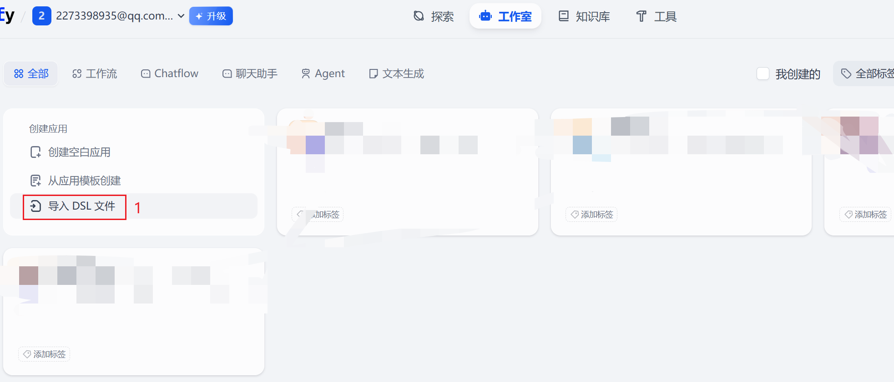</div>

---

## 🛠️ 前置准备

### 1. 平台与账号准备

- **Dify 平台账号**：确保已注册并登录 [Dify](https://dify.ai/zh) 平台(也可采用docker部署)
- **邮箱账号**：需要一个支持 SMTP 的邮箱（本教程使用 163 邮箱）
- **大模型 API**：需要配置文心飞桨星河社区的 API

### 2. 安装必要的插件

在 Dify 插件市场中安装以下插件：

| 插件名称 | 用途 |
|---------|------|
| PaddleOCR | PDF/图片 OCR 解析 |
| 163SMTP邮件发送 | 163 邮箱 SMTP 发送 |
| Supabase | 数据库存储（记录已推送论文）|
| 文心飞桨星河社区 | 星河社区 API 调用百度文心大模型调用 |

### 3. 准备 Supabase 数据库

为了实现对已经给用户推送过的论文过滤的功能，这里使用[云端数据库supabase](https://supabase.com/)，先点击右上角登录，然后点击[Start your project]

#### 步骤 1：登录并创建项目

<div align="center"></div>

<div align="center"></div>

#### 步骤 2：创建数据表

在 SQL Editor 中执行以下 SQL 语句：

<div align="center"></div>

**在数据库中新建一张用于记录论文推送信息的表**，表名定义为`pushed_papers`，同时为表设置了两个核心字段并添加了数据完整性约束，确保论文推送记录的唯一性和有效性。

```sql
create table pushed_papers (
  arxiv_id text not null,
  pushed_at timestamp default now(),
  primary key (arxiv_id)
);
```

#### 步骤 3：获取 API 密钥

<div align="center"></div>

<div align="center">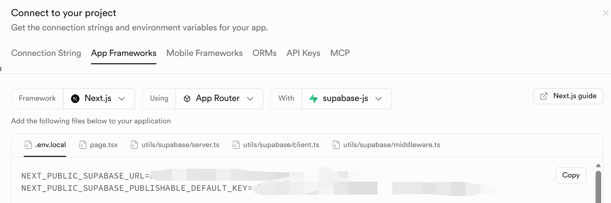</div>

记录以下信息：
- `NEXT_PUBLIC_SUPABASE_URL` → 对应 Dify Supabase 插件的 Supabase URL
- `NEXT_PUBLIC_SUPABASE_PUBLISHABLE_DEFAULT_KEY` → 对应 Dify Supabase 插件的 Supabase Key

#### 步骤 4：在 Dify 中配置 Supabase 插件

<div align="center"></div>

<div align="center">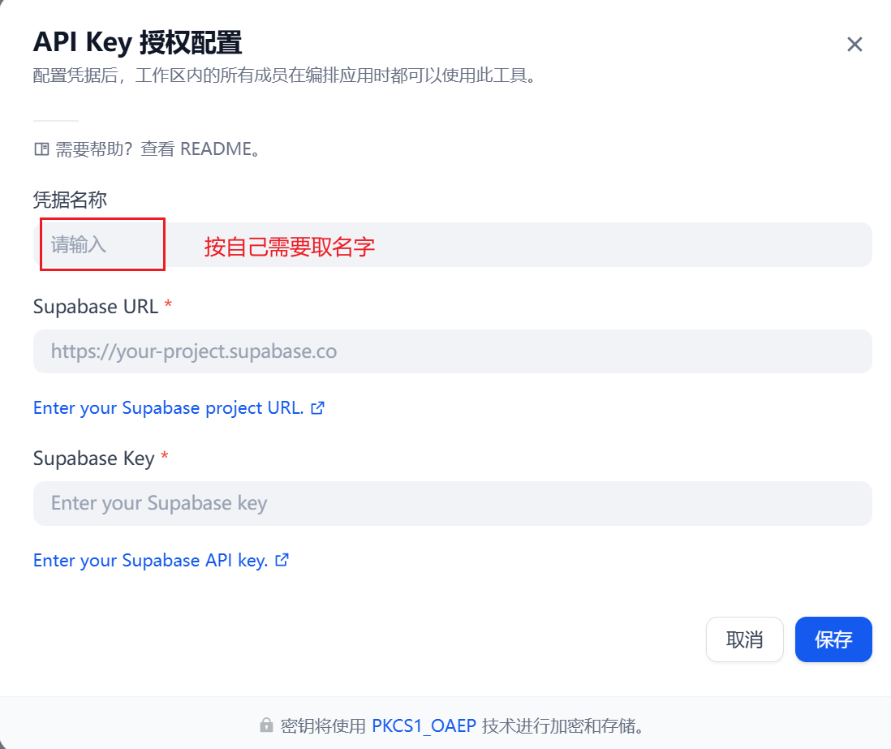</div>

#### (可选)docker部署dify

##### 环境配置

环境说明，本人使用的是[wsl](https://learn.microsoft.com/zh-cn/windows/wsl/install)+[docker](https://www.docker.com/)。可参考[文章](https://learn.microsoft.com/zh-cn/windows/wsl/tutorials/wsl-containers)配置wsl和docker。

##### 拉取dify的仓库

首先需要拉取dify的仓库，假如你没有配置git的话，可以直接在[仓库网页](https://github.com/langgenius/dify.git)下载压缩包并解压。

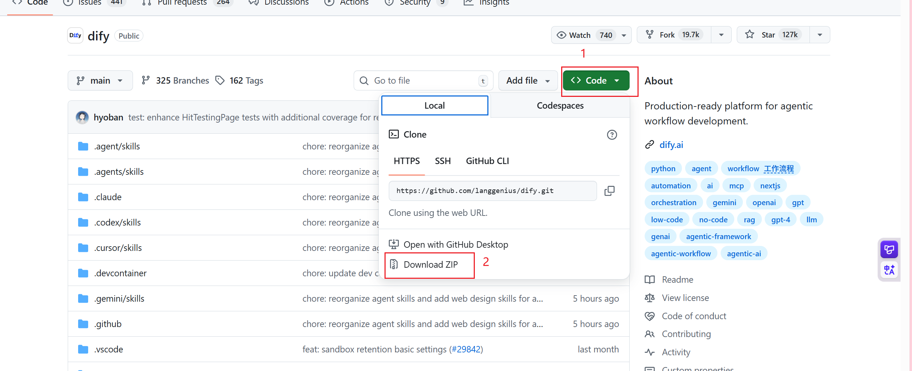

假如你已经配置了git，直接在终端运行下列命令：

```Bash
# 克隆 Dify 代码仓库
git clone https://github.com/langgenius/dify.git
```

需要配置git和docker。

```Bash
# 进入 docker 部署目录
cd dify/docker

# 复制环境配置文件
cp .env.example .env

# 启动 Dify (这将自动拉取镜像并启动所有服务)
docker compose up -d
```

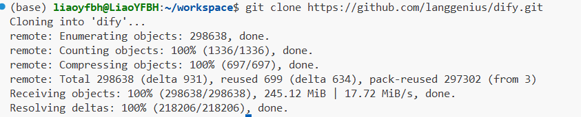

需要先打开docker desktop软件，然后在终端输入：

```Python
docker compose up -d
```

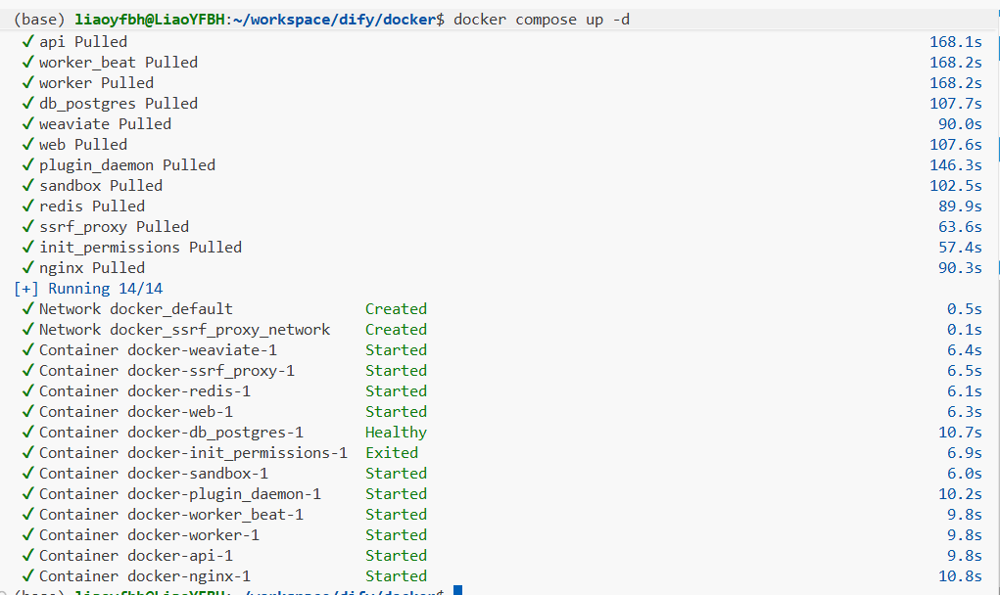

```Python
docker compose ps
```

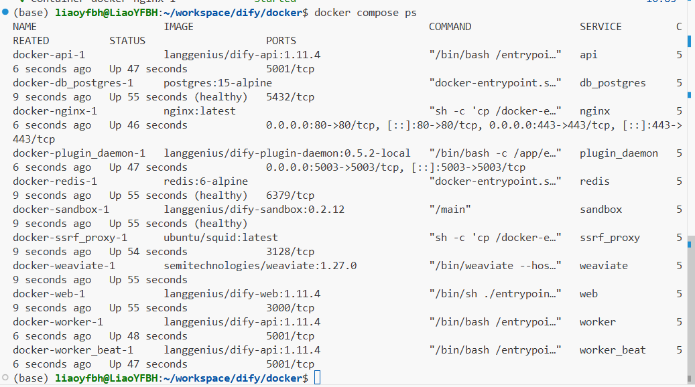

http://localhost/

在登录界面输入之后，

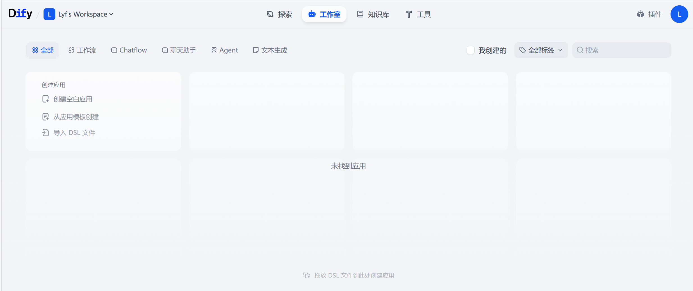

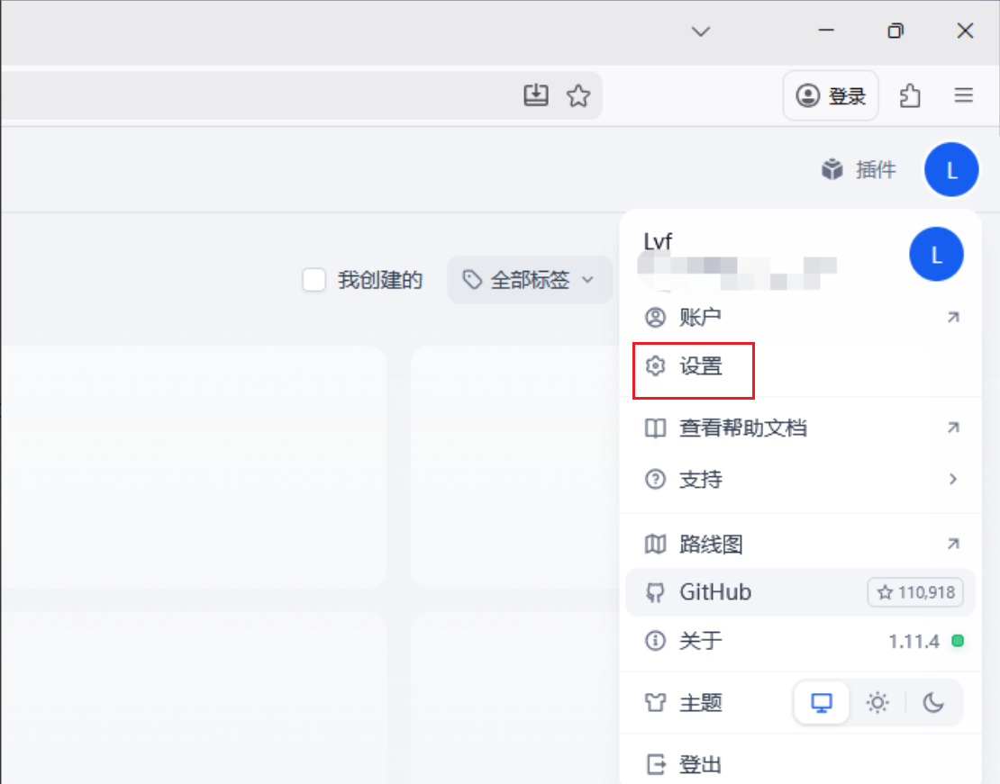

---

## 📊 工作流总体架构

整个工作流的核心流程如下：

<div align="center">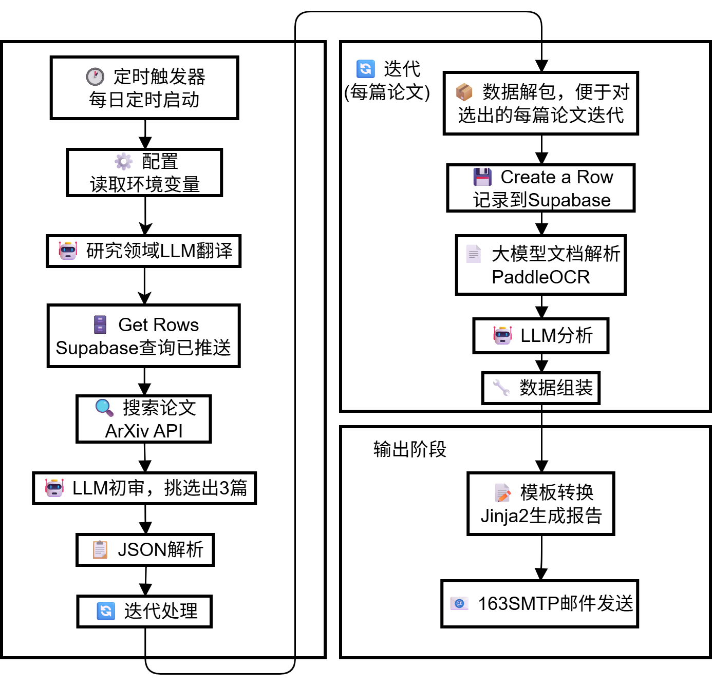</div>

### 流程说明

| 阶段 | 节点 | 功能描述 |
|------|------|----------|
| **触发** | 定时触发器 | 每日指定时间自动启动 |
| **配置** | 配置节点 | 读取所有环境变量并输出供后续使用 |
| **翻译** | LLM翻译 | 将研究主题翻译为英文 |
| **搜索** | Get Rows → 预处理 → HTTP请求 → 后处理 | 查询已推送记录，搜索 ArXiv 新论文 |
| **初审** | LLM初审 | 使用 LLM 筛选 Top 3 论文 |
| **迭代** | 迭代节点 | 对每篇论文执行：解包→记录→OCR→分析→组装 |
| **输出** | 模板转换 → 邮件发送 | 生成格式化报告并邮件推送 |

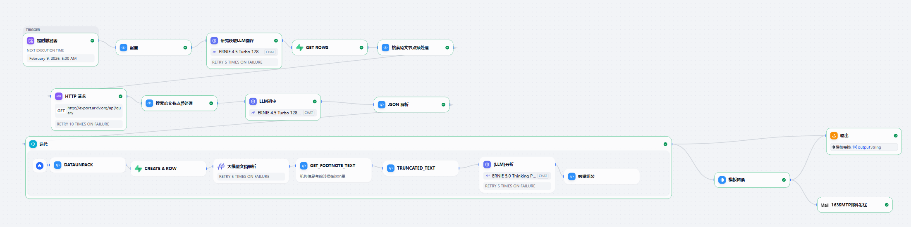

---

## 🔧 详细搭建步骤

### 第一步：创建工作流

1. 登录 [Dify](https://dify.ai/zh) 平台
2. 点击「工作室」→「创建应用」→ 选择「工作流」类型

<div align="center"></div>

3. 输入应用名称

<div align="center"></div>

4. 选择触发器类型

<div align="center">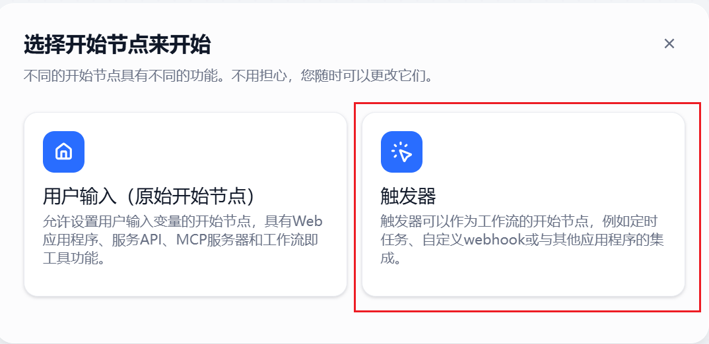</div>

---

### 第二步：配置环境变量

在 UI 界面右上角点击设置按钮：

<div align="center"></div>

点击添加环境变量：

<div align="center">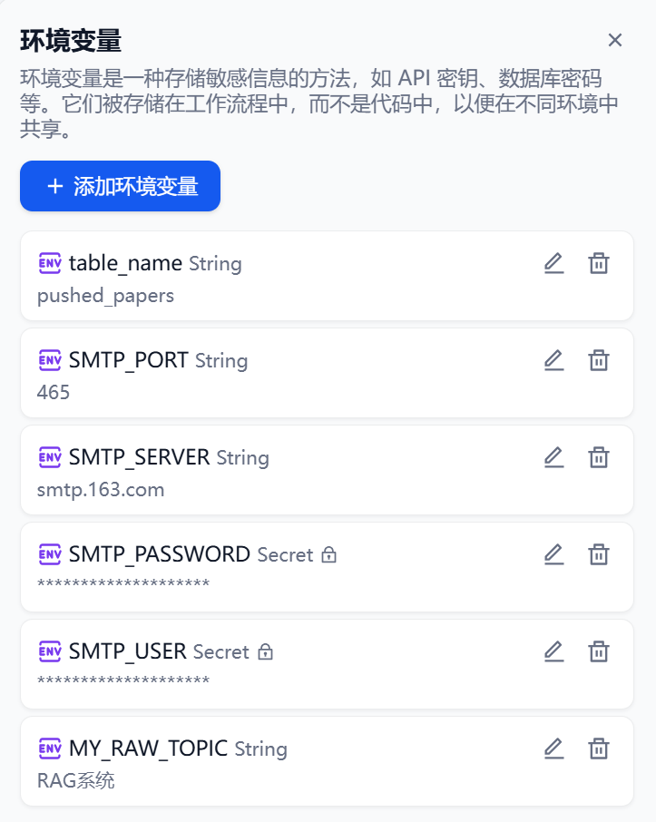</div>

| 变量名 | 类型 | 说明 | 示例值 |
|--------|------|------|--------|
| `table_name` | string | Supabase 表名 | `pushed_papers` |
| `SMTP_PORT` | string | 邮箱 SMTP 端口 | `465` |
| `SMTP_SERVER` | string | SMTP 服务器 | `smtp.163.com` |
| `SMTP_PASSWORD` | secret | 邮箱授权码 | (你的授权码) |
| `SMTP_USER` | secret | 邮箱账号 | `your_email@163.com` |
| `MY_RAW_TOPIC` | string | 研究主题 | `agent记忆` |

获取邮箱授权码的方式：

<div align="center">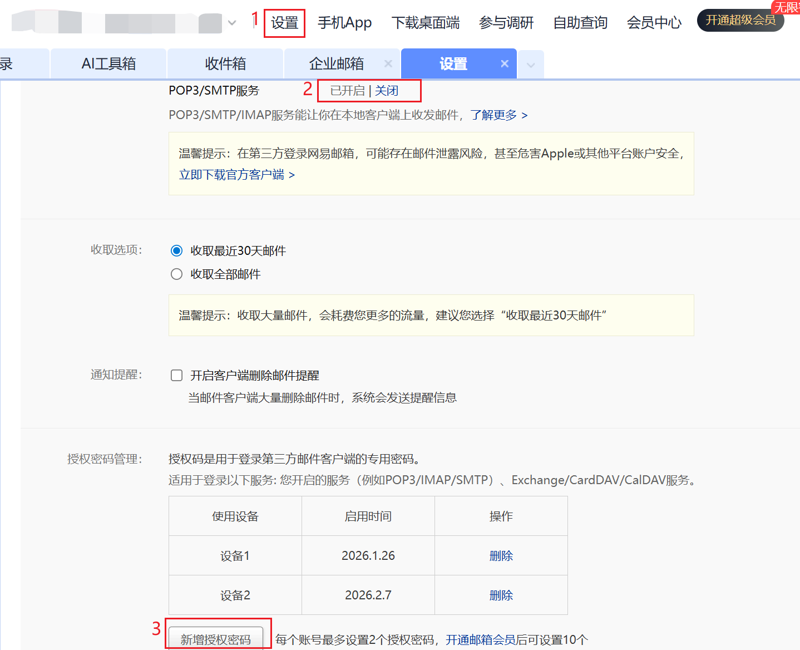</div>

---

### 第三步：定时触发器节点

**节点名称**：`定时触发器`

配置项：
- **触发频率**：每日（daily）
- **触发时间**：`8:59 AM`（或根据需求调整）

<div align="center">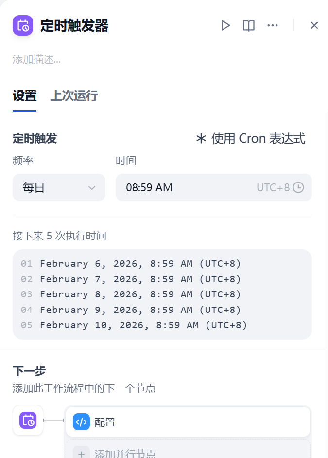</div>

---

### 第四步：配置节点（代码节点）

**节点名称**：`配置`  
**节点类型**：`code`

该节点负责读取所有环境变量并输出供后续节点使用。

<div align="center">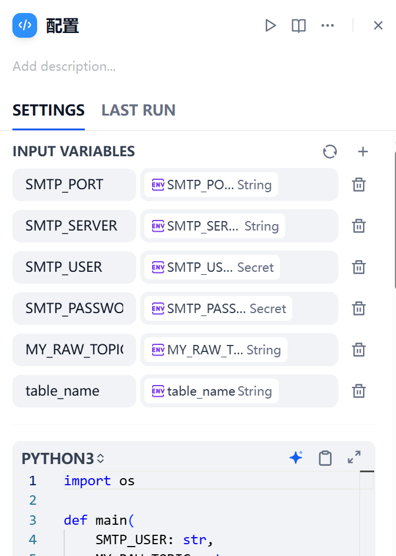</div>

**输入变量**：
- 从环境变量读取：`SMTP_PORT`, `SMTP_SERVER`, `SMTP_USER`, `SMTP_PASSWORD`, `MY_RAW_TOPIC`, `table_name`

**输出变量**：
- `raw_topic`：研究主题
- `user_email`：接收邮箱
- `fetch_count`：搜索论文数量（默认 50）
- `push_limit`：推送数量限制（默认 3）
- `days_lookback`：回溯天数（默认 30）
- 以及 SMTP 相关配置

**代码**：

```python
import os

def main(
    SMTP_USER: str,
    MY_RAW_TOPIC: str,
    SMTP_PORT: str,
    SMTP_SERVER: str,
    SMTP_PASSWORD: str,
    table_name: str
) -> dict:

    user_email = SMTP_USER
    raw_topic = MY_RAW_TOPIC

    smtp_port = SMTP_PORT
    smtp_server = SMTP_SERVER
    smtp_password = SMTP_PASSWORD
    table_name = table_name

    return {
        "raw_topic": raw_topic,
        "user_email": user_email,
        "smtp_port": smtp_port,
        "smtp_server": smtp_server,
        "smtp_password": smtp_password,
        "fetch_count": 50,
        "push_limit": 3,
        "days_lookback": 30,
        "table_name": table_name
    }
```

---

### 第五步：研究领域翻译（LLM节点）

**节点名称**：`研究领域LLM翻译`  
**节点类型**：`llm`

将中文研究主题翻译为 ArXiv API 可识别的英文布尔查询字符串。

**模型配置**：

- 模型：`ernie-4.5-turbo-128k` 或 `ernie-5.0-thinking-preview`
- 温度：`0.7`

<div align="center">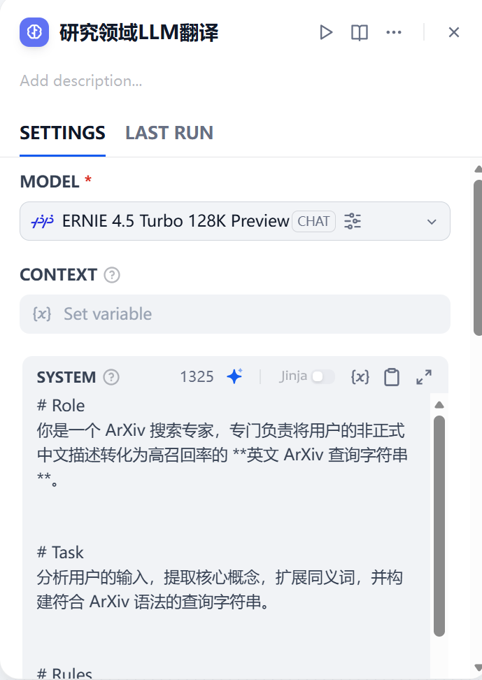</div>

---

### 第六步：查询已推送记录（Supabase节点）

**节点名称**：`Get Rows`  
**节点类型**：`tool` (Supabase)

从 Supabase 数据库查询已推送的论文记录，避免重复推送。

**配置**：
- 表名：`{{table_name}}`（从配置节点获取）

<div align="center">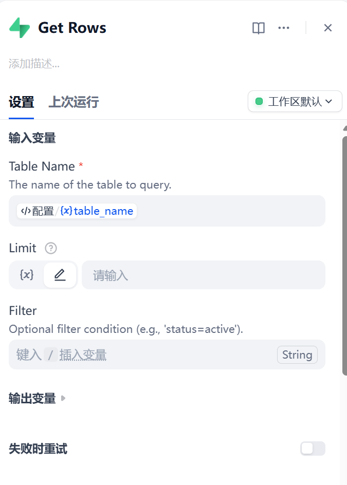</div>

---

### 第七步：搜索论文（拆分为3个节点）

为了提高工作流的稳定性和可维护性，将搜索功能拆分为 "预处理" → "HTTP请求" → "后处理" 三个连续的节点。

#### 7.1 搜索论文节点预处理 (代码节点)

**节点名称**：`搜索论文节点预处理`  
**节点类型**：`code`

该节点负责准备搜索参数，计算日期范围，并构建 ArXiv API 查询字符串。

<div align="center">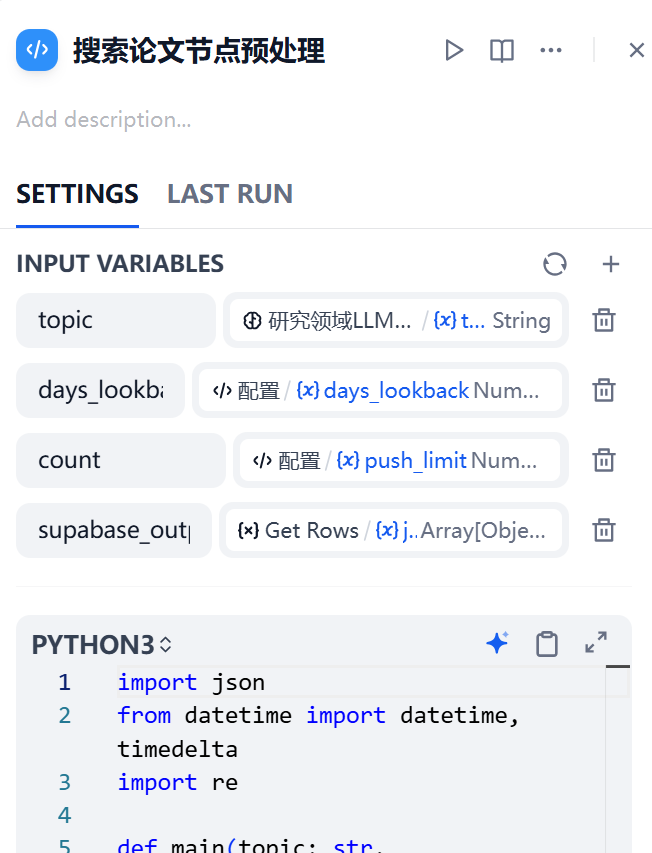</div>

**输入变量**：
- `topic`：翻译后的英文搜索词
- `days_lookback`：回溯天数
- `count`：搜索数量
- `supabase_output`：已推送记录（用于去重）

**代码逻辑**：
1. 计算回溯日期（cutoff_date）
2. 解析 Supabase 返回的已推送论文 ID 列表
3. 根据 topic 构建布尔查询字符串（支持 AND/OR 逻辑）
4. 根据 topic 关键词添加 ArXiv 分类限制（如 cs.CV, cs.CL 等）
5. 提取搜索关键词用于后续过滤

**输出变量**：
- `base_query`：构建好的查询字符串
- `pushed_ids`：已推送 ID 列表
- `cutoff_str`：截止日期字符串
- `search_keywords`：搜索关键词列表
- `fetch_limit`：API 获取数量上限

#### 7.2 HTTP 请求 (HTTP 节点)

**节点名称**：`HTTP 请求`  
**节点类型**：`http-request`

直接调用 ArXiv API 获取原始 XML 数据。

**配置**：
- **API URL**: `http://export.arxiv.org/api/query`
- **Method**: `GET`

<div align="center">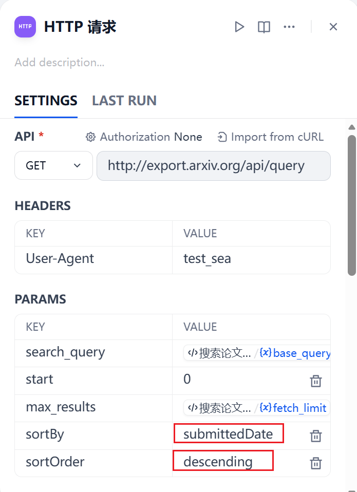</div>

#### 7.3 搜索论文节点后处理 (代码节点)

**节点名称**：`搜索论文节点后处理`  
**节点类型**：`code`

解析 API 返回的 XML 数据，并进行精细过滤。

<div align="center">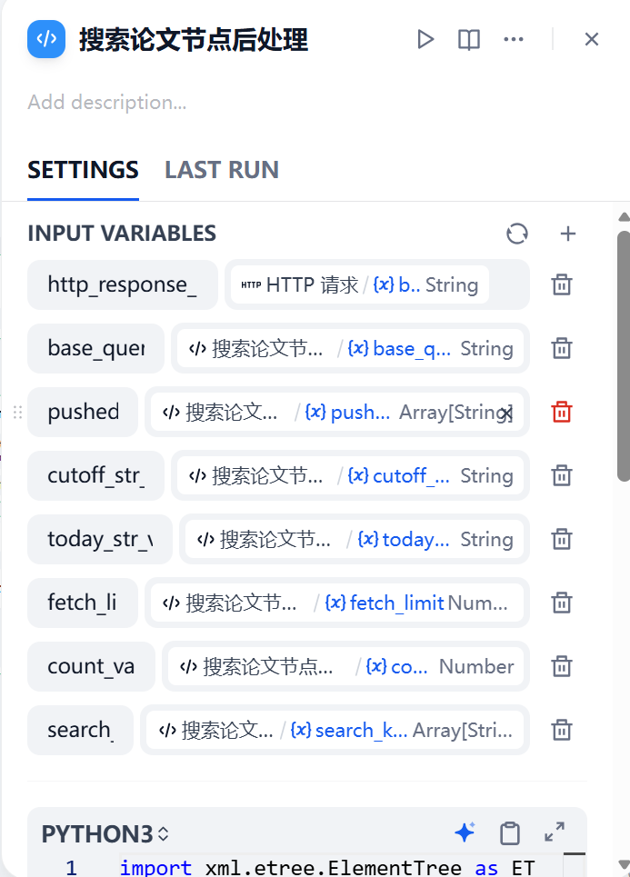</div>

**输入变量**：
- `http_response_body`: HTTP 节点的响应体
- 以及预处理节点的所有输出变量

**代码逻辑**：
1. 解析 XML 响应
2. **去重过滤**：剔除在 `pushed_ids` 中的论文
3. **日期过滤**：剔除早于 `cutoff_date` 的论文
4. **关键词过滤**：确保标题或摘要中包含至少一个搜索关键词
5. 格式化输出为 JSON 对象列表

**输出变量**：
- `result`：最终筛选出的论文列表（JSON 字符串）
- `count`：最终论文数量
- `debug`：调试信息（包含过滤统计）

---

### 第八步：LLM初审筛选（LLM节点）

**节点名称**：`LLM初审`  
**节点类型**：`llm`

使用 LLM 对论文进行初步评审，筛选出最有价值的论文。

**输出要求**：
- 纯净 JSON 数组格式
- 保留所有原始字段
- 输出 Top 3 论文

<div align="center">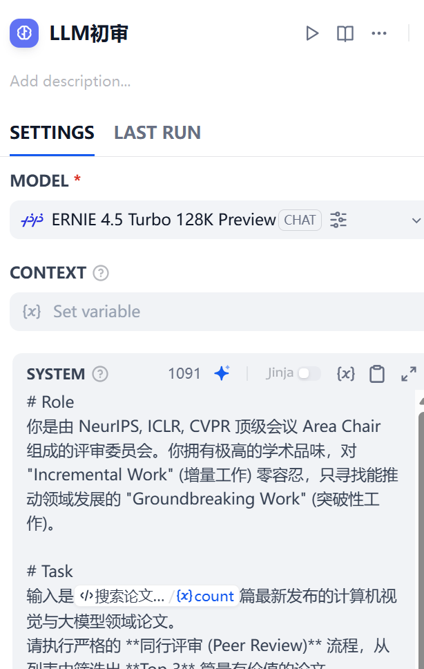</div>

---

### 第九步：JSON解析（代码节点）

**节点名称**：`JSON 解析`  
**节点类型**：`code`

解析 LLM 输出的 JSON 字符串，处理各种可能的格式。

**核心逻辑**：
- 处理嵌套 JSON
- 支持 `papers` 或 `top_papers` 字段
- 容错处理

<div align="center">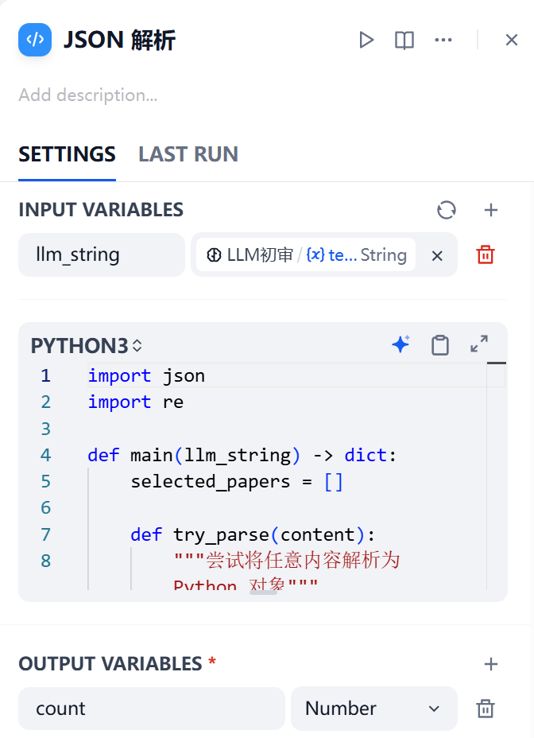</div>

---

### 第十步：迭代节点

**节点名称**：`迭代`  
**节点类型**：`iteration`

对筛选后的每篇论文进行迭代处理。

**配置**：
- **输入**：`top_papers`（论文数组）
- **输出**：`merged_paper`（处理后的论文对象）
- **并行模式**：关闭（顺序执行）
- **错误处理**：遇错终止

#### 迭代内部详细流程

| 序号 | 节点名称 | 类型 | 功能 |
|------|----------|------|------|
| 1 | DataUnpack | code | 将迭代项拆解为独立变量 |
| 2 | Create a Row | tool | 将 arxiv_id 记录到 Supabase 防重复 |
| 3 | 大模型文档解析 | tool | PaddleOCR 解析 PDF 提取正文 |
| 4 | get_footnote_text | code | 提取脚注信息（用于机构识别） |
| 5 | truncated_text | code | 裁剪 OCR 文本（控制 LLM 输入长度） |
| 6 | (LLM)分析 | llm | 深度分析论文提取关键信息 |
| 7 | 数据组装 | code | 组装最终的论文对象 |

#### 10.1 DataUnpack（代码节点）

将迭代项拆解为独立变量。

<div align="center">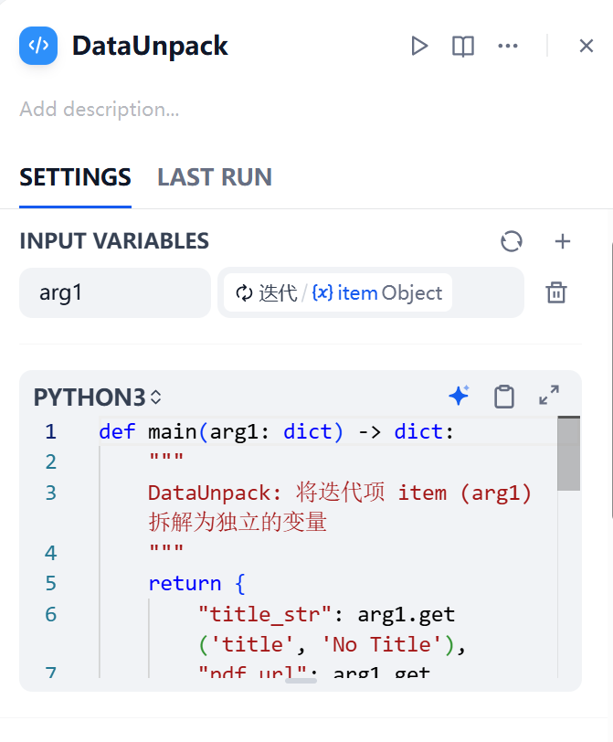</div>

**输出**：
- `title_str`：论文标题
- `pdf_url`：PDF 链接
- `summary_str`：摘要
- `published`：发布日期
- `authors`：作者
- `arxiv_id`：ArXiv ID

#### 10.2 Create a Row（Supabase节点）

将论文 ArXiv ID 记录到数据库，防止重复推送。

<div align="center"></div>

**配置**：
- 表名：从配置节点获取
- 数据：`{"arxiv_id": "{{arxiv_id}}"}`

#### 10.3 大模型文档解析（PaddleOCR节点）

**节点名称**：`大模型文档解析`  
**节点类型**：`tool` (PaddleOCR)

使用 PaddleOCR 解析论文 PDF，提取正文内容。

<div align="center">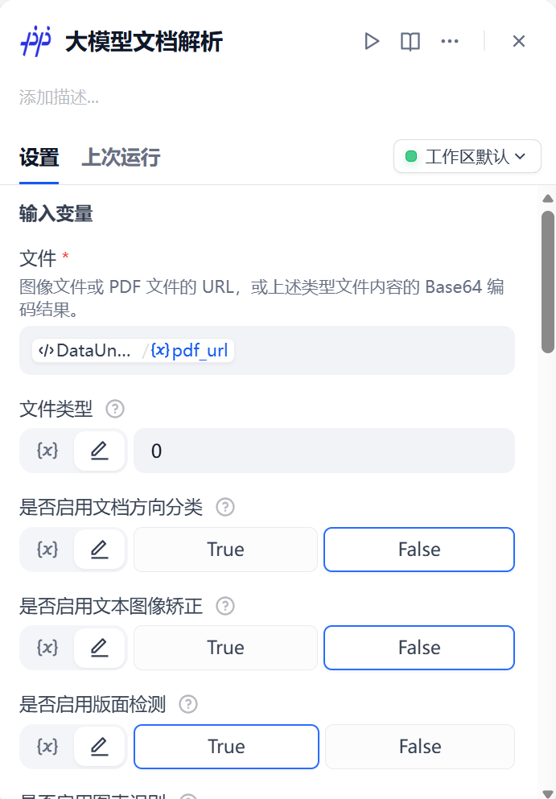</div>

**配置**：
- `file`：PDF URL
- `fileType`：0（PDF 文件）
- `useLayoutDetection`：true（启用版面检测）
- `prettifyMarkdown`：true（美化输出）

#### 10.4 get_footnote_text（代码节点）

提取 OCR 文本中的脚注信息，用于后续的机构识别。

<div align="center">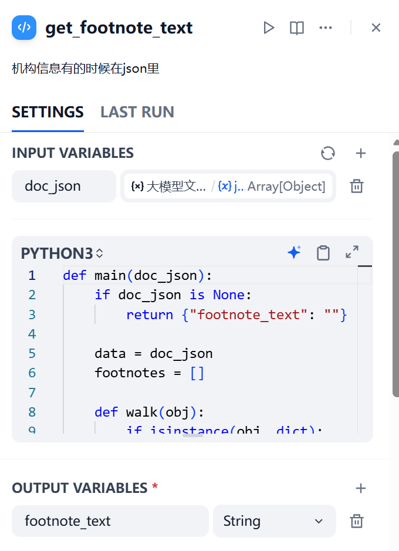</div>

#### 10.5 truncated_text（代码节点）

裁剪 OCR 文本以控制 LLM 输入长度，避免超出 token 限制。

<div align="center">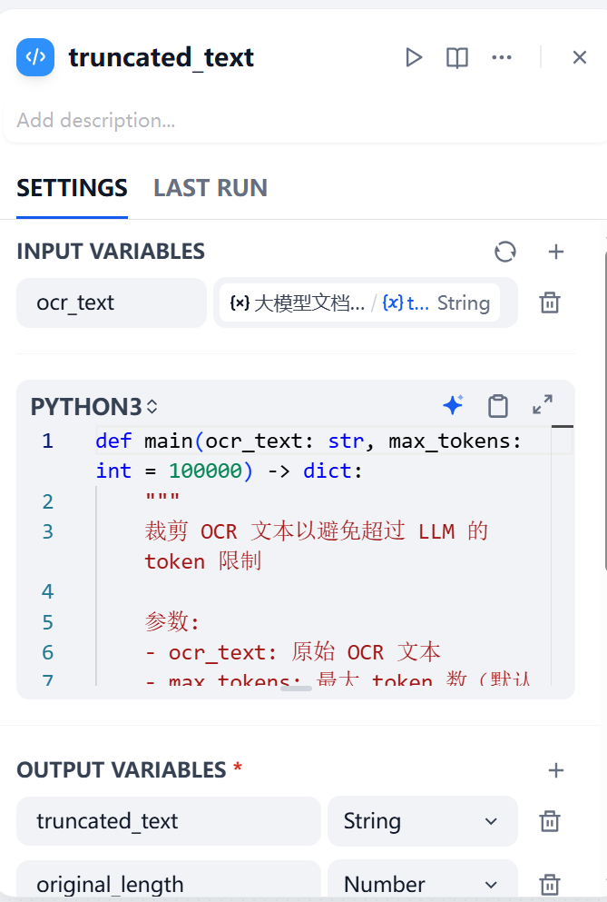</div>

#### 10.6 LLM深度分析

**节点名称**：`(LLM)分析`  
**节点类型**：`llm`

对论文进行深度分析，提取关键信息。

<div align="center">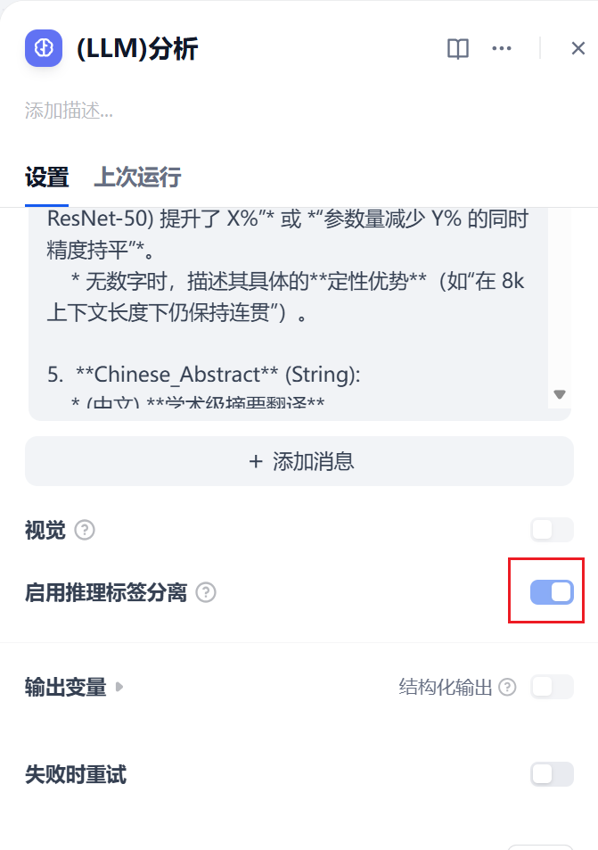</div>

**提取字段**：
1. **One_Liner**：一句话痛点与解决方案
2. **Architecture**：模型架构与关键创新点
3. **Dataset**：数据来源与规模
4. **Metrics**：核心性能指标
5. **Chinese_Abstract**：中文摘要翻译
6. **Affiliation**：作者机构
7. **Code_Url**：代码链接

**核心原则**：
- 拒绝废话：直接说具体方法
- 深挖细节：总结算法逻辑、损失函数设计
- 数据优先：展示对比 SOTA 的提升幅度
- 禁止 N/A：合理推断

**输出格式**：纯 JSON 对象

#### 10.7 数据组装（代码节点）

**节点名称**：`数据组装`  
**节点类型**：`code`

将所有信息组装成结构化的论文对象。

<div align="center">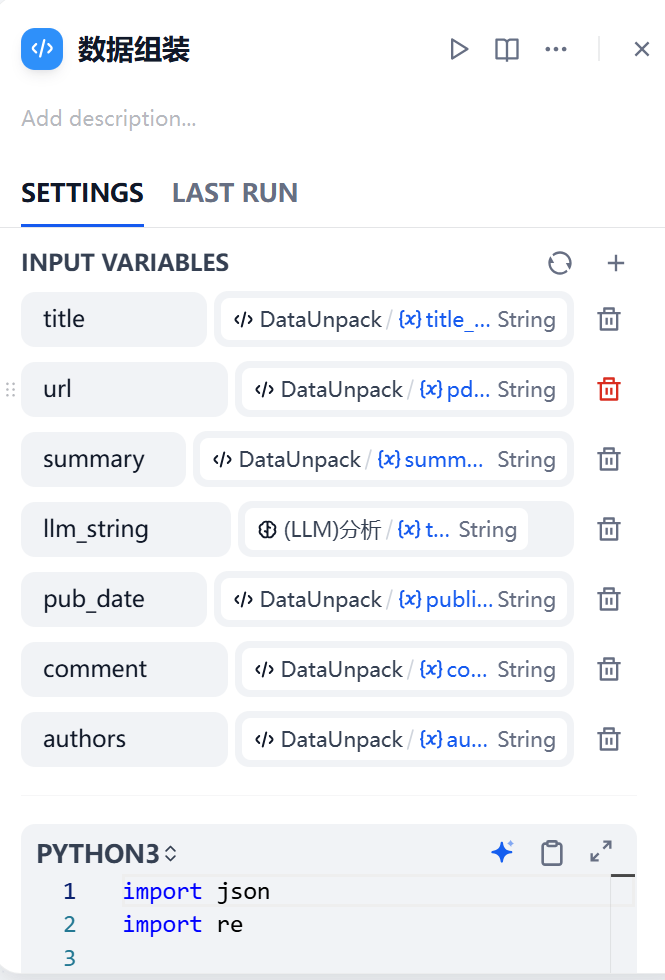</div>

**核心功能**：
1. 解析发布状态（识别顶会论文）
2. 解析 LLM 输出的 JSON
3. 提取代码链接
4. 组装最终论文对象

**输出字段**：
- `title`：标题
- `authors`：作者
- `affiliation`：机构
- `pdf_url`：PDF 链接
- `summary`：英文摘要
- `published`：发布状态
- `github_stats`：代码状态
- `code_url`：代码链接
- `ai_evaluation`：AI 分析结果

---

### 第十一步：模板转换

**节点名称**：`模板转换`  
**节点类型**：`template-transform`

使用 Jinja2 模板将论文数据转换为格式化的邮件内容。

<div align="center">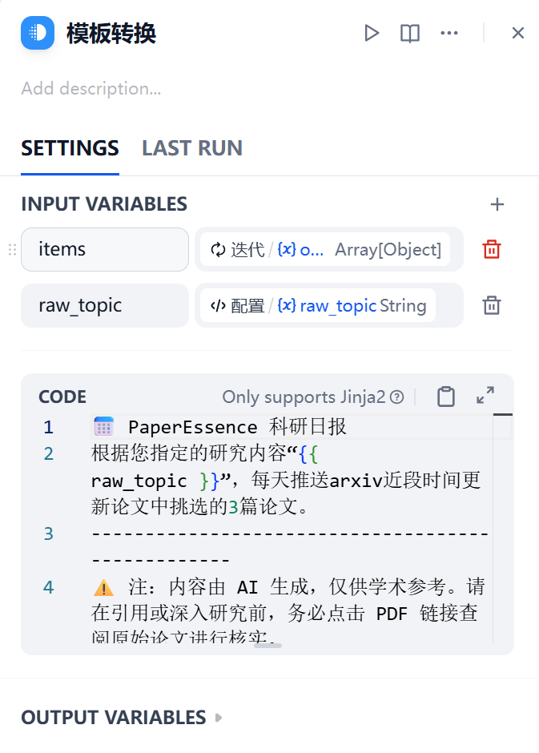</div>

**模板结构**：

```jinja2
📅 PaperEssence 科研日报
根据您指定的研究内容"{{ raw_topic }}"，每天推送 arxiv 近 30 天更新论文中挑选的 3 篇论文。
--------------------------------------------------
<small><i>⚠️ 注：内容由 AI 生成，仅供学术参考。请在引用或深入研究前，务必点击 PDF 链接查阅原始论文进行核实。</i></small>
生成日期: {{ items.target_date | default('Today') }}
==================================================




📄 [{{ loop.index }}] {{ item.title }}
--------------------------------------------------
👤 作者: {{ item.authors }}
🏢 机构: {{ item.affiliation }}
🔗 PDF: {{ item.pdf_url }}
📅 状态: {{ item.published }}

📦 Code: {{ item.github_stats }}
   🔗 {{ item.code_url }}

📦 Code: {{ item.github_stats }}


English Abstract:
{{ item.summary | replace('\n', ' ') }}

中文摘要:
{{ item.ai_evaluation.Chinese_Abstract }}

🚀 核心创新:
{{ item.ai_evaluation.One_Liner }}

📊 总结:
--------------------------------------------------
🏗️ 架构:
{{ item.ai_evaluation.Architecture | replace('\n- ', '\n\n   🔹 ') | replace('- ', '   🔹 ') }}

💾 数据:
{{ item.ai_evaluation.Dataset | replace('\n- ', '\n\n   🔹 ') | replace('- ', '   🔹 ') }}

📈 指标:
{{ item.ai_evaluation.Metrics | replace('\n- ', '\n\n   🔹 ') | replace('- ', '   🔹 ') }}

==================================================

⚠️ 今日无新论文更新。

```

---

### 第十二步：邮件发送

**节点名称**：`163SMTP邮件发送`  
**节点类型**：`tool` (163-smtp-send-mail)

<div align="center"></div>

**配置**：
- `username_send`：发件人邮箱（从环境变量读取）
- `authorization_code`：邮箱授权码（从环境变量读取）
- `username_recv`：收件人邮箱
- `subject`：`PaperEssence-{{cutoff_str}}-{{today_str}}`
- `content`：模板转换后的内容

---

### 第十三步：输出节点

**节点名称**：`输出`  
**节点类型**：`end`

输出最终结果，便于调试和验证。

<div align="center">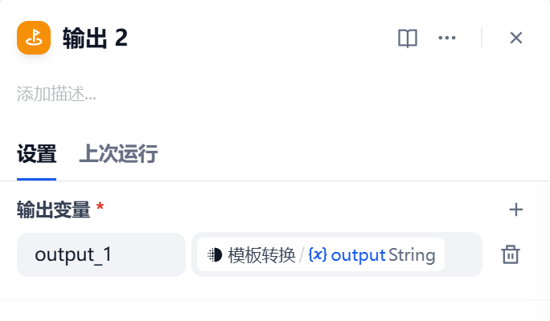</div>

---

## 📤 发布工作流并获取 API

等 workflow 调试通过后：

<div align="center">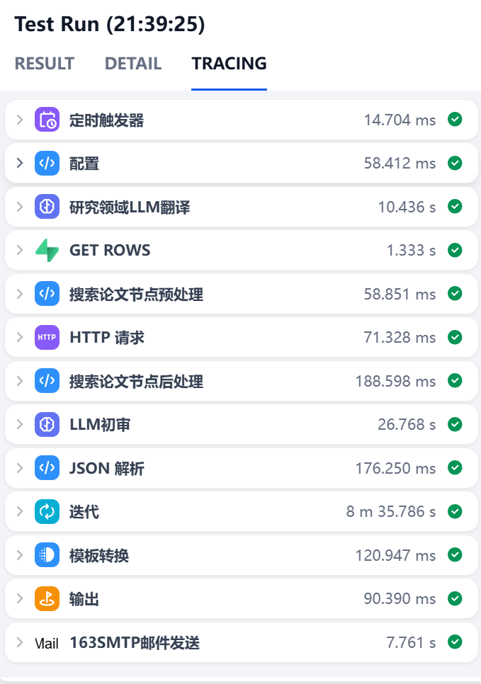</div>

点击右上角发布：

<div align="center"></div>

<div align="center"></div>

记录以下信息：
- **API 端点**：`https://api.dify.ai/v1/workflows/run`（或你的私有部署地址）
- **API 密钥**：形如 `app-xxxxxxxxxxxx` 的字符串

---

## ⏰ 配置每天自动运行

由于 Dify 云端平台的定时触发器在免费版可能存在限制，可以使用 Windows 任务计划程序配合脚本来实现每日定时触发工作流。

### 前置条件：安装 Git for Windows

本方案使用 Git Bash 执行 curl 命令，因此需要先安装 Git for Windows。

📥 **下载地址**：[https://git-scm.com/downloads/win](https://git-scm.com/downloads/win)

安装时注意：
- 建议选择默认安装路径（如 `C:\Program Files\Git`）或自定义路径（如 `D:\ProgramFiles\Git`）
- 安装选项中确保勾选 "Git Bash Here"

### 配置 Windows 任务计划程序

1. 按下 `Win + R` → 输入 `taskschd.msc`，回车，打开任务计划程序
2. 点击右侧「创建任务」

#### 常规标签：
- **名称**：`Paper-Essence Daily Run`
- 勾选「使用最高权限运行」

#### 触发器标签：
1. 点击「新建」
2. 「开始任务」下拉框选择「按预定计划」
3. 选择「每天」，设置触发时间（建议与 Dify 工作流中的定时器时间一致，如 `20:55`）
4. 点击「确定」

#### 操作标签：
1. 点击「新建」
2. 操作选择「启动程序」
3. **程序或脚本**：输入你的 Git Bash 路径，例如：
   ```
   D:\ProgramFiles\Git\bin\bash.exe
   ```
   或默认安装路径：
   ```
   C:\Program Files\Git\bin\bash.exe
   ```
4. **添加参数**：
   
   ```
   curl -N -X POST "https://api.dify.ai/v1/workflows/run" -H "Authorization: Bearer app-你的API密钥" -H "Content-Type: application/json" -d '{ "inputs": {}, "response_mode": "streaming", "user": "cron-job" }'
   ```
   
   > ⚠️ **注意**：将 `app-你的API密钥` 替换为你实际的 API 密钥

#### 条件标签（可选）：
- 可以取消勾选「只有在计算机使用交流电源时才启动此任务」，确保笔记本电脑在电池模式下也能执行

#### 设置标签（可选）：

- 勾选「如果任务失败，按以下频率重新启动」，可设置重试间隔

5. 点击「确定」保存任务

<div align="center">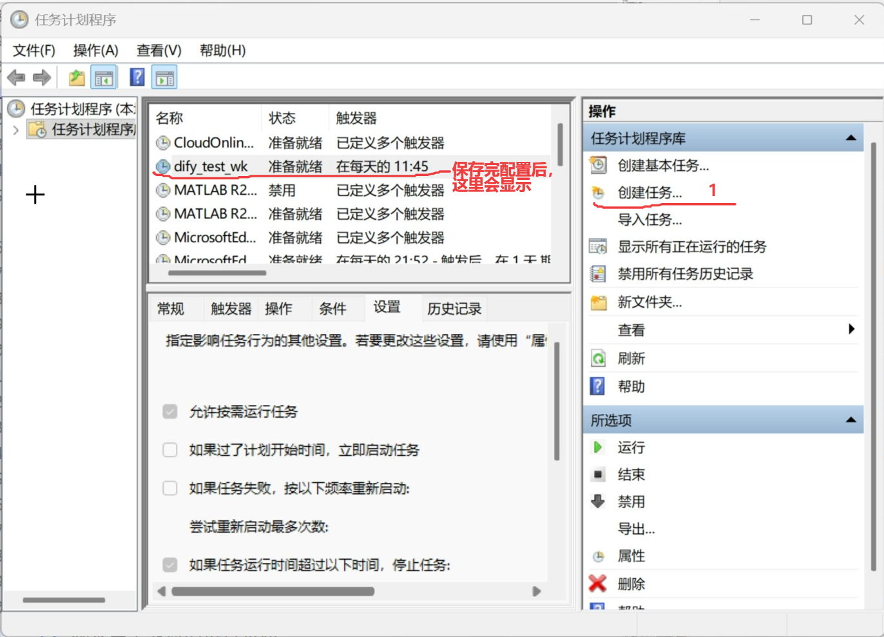</div>

---

## 🧪 测试与调试

### 手动测试

1. 点击工作流编辑器右上角的「运行」按钮
2. 观察每个节点的执行状态
3. 检查各节点的输出是否符合预期

### 成功运行效果

当工作流成功执行后，你将在邮箱中收到如下格式的论文日报邮件：

<div align="center">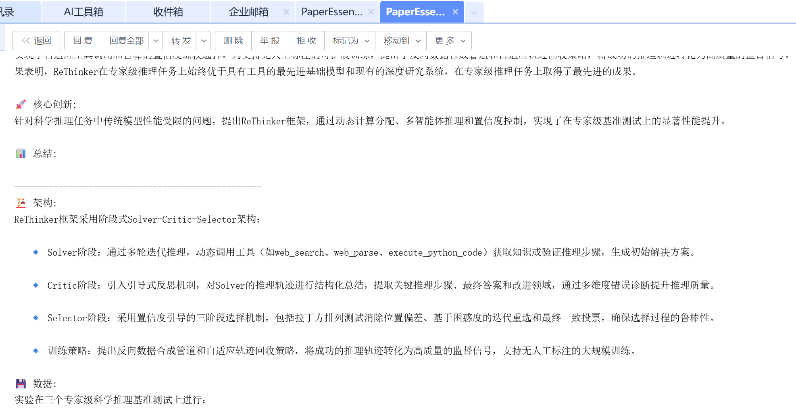</div>

---

## 📝 总结

本教程涉及 YAML 节点配置与调度、环境变量与 Supabase 使用，并搭建了从 ArXiv 抓取 → PaddleOCR 解析 → LLM 分析 → Jinja2 模板化 → SMTP 投递的端到端流水线，同时加强了去重、错误处理。

## 致谢
感谢张晶老师、关木老师、杨有志老师的指导。