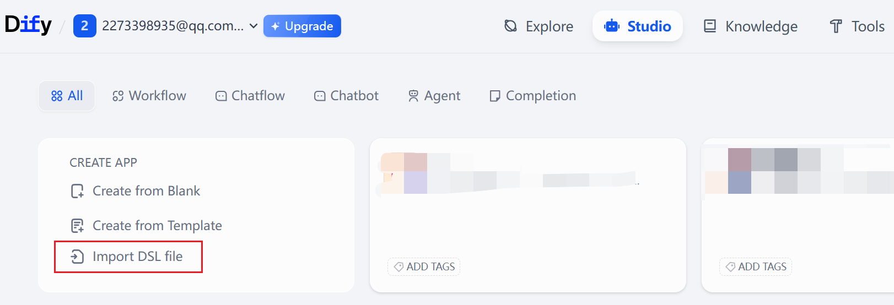
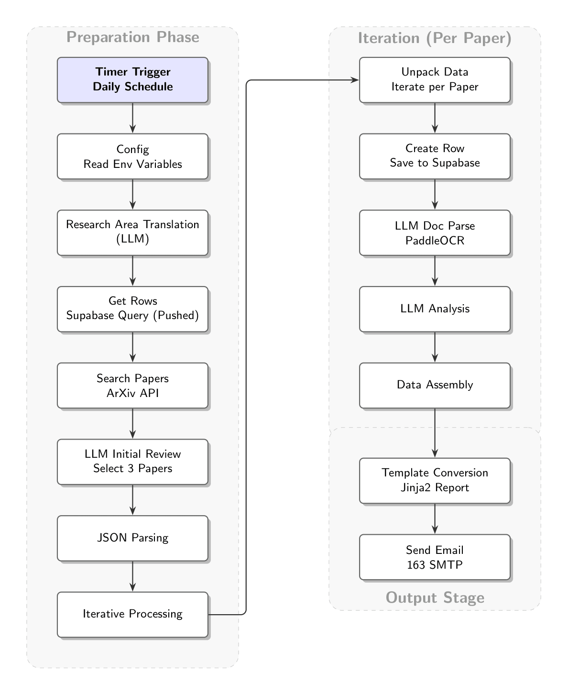
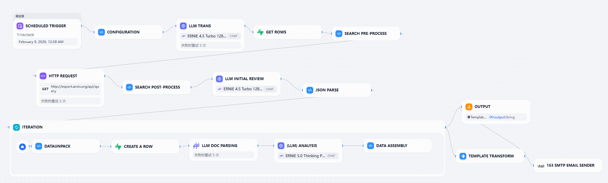
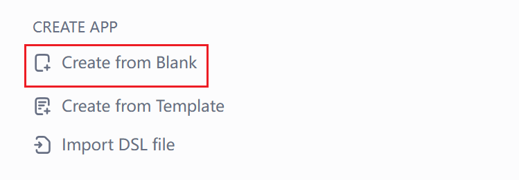
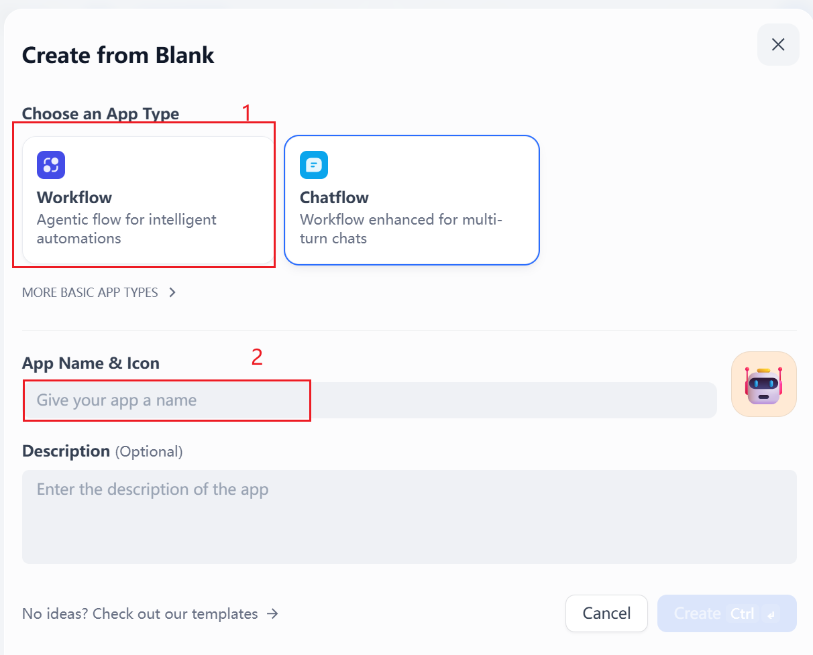
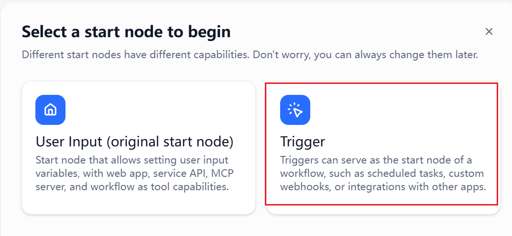
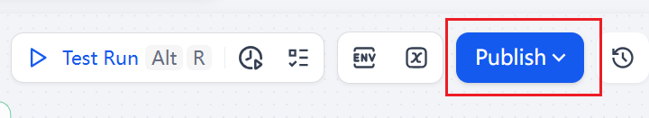
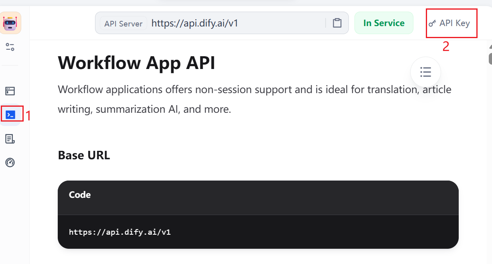
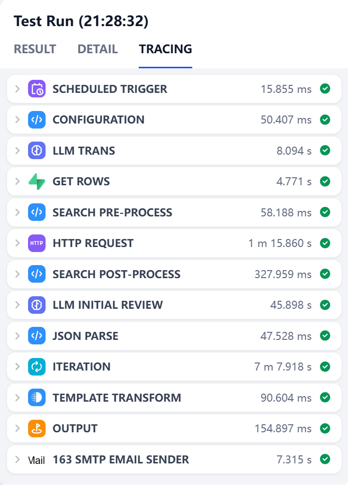

# Paper-Essence — Tutorial: Building an Automated Paper Digest Workflow

## 📖 Project Overview

**Paper-Essence** is an automated paper-digest workflow built on the Dify platform. This workflow can:

- 🕐 Fetch the latest papers from arXiv for specified research areas on a daily schedule
- 🤖 Use large language models to filter and select the most valuable papers
- 📄 Parse PDF papers with OCR to extract technical details
- 📧 Generate a structured daily digest and send it by email

GitHub repository: https://github.com/LiaoYFBH/PaperFlow — you can import `prj/Paper-Essence-CN.yml` or `prj/Paper-Essence-EN.yml` directly.

<div align="center"></div>

---

## 🛠️ Prerequisites

### 1. Platform and Accounts

- **Dify account**: Register and log in to Dify
- **Email account**: An SMTP-capable email (this tutorial uses 163 Mail)
- **LLM API**: Configure either Baidu Wenxin or an OpenAI-compatible model

### 2. Install Required Plugins

Install the following plugins from the Dify plugin marketplace:

| Plugin | Purpose |
|--------|---------|
| `paddle-aistudio/ernie-paddle-aistudio` | Baidu Wenxin LLM integration (Xinghe Community API) |
| `langgenius/paddleocr` | OCR for PDFs and images |
| `wjdsg/163-smtp-send-mail` | 163 SMTP email sending |
| `langgenius/supabase` | Database storage for pushed records |

### 3. Prepare Supabase Database

We use a cloud database ([Supabase](https://supabase.com/)) to record papers that have already been pushed to avoid duplicates.

#### Step 1: Login and Create Project

<div align="center"></div>

<div align="center"></div>

#### Step 2: Create Table

In the SQL Editor, run the following SQL statement:

<div align="center"></div>

```sql
create table pushed_papers (
  arxiv_id text not null,
  pushed_at timestamp default now(),
  primary key (arxiv_id)
);
```

This table records pushed paper IDs to ensure no duplicates.

<div align="center"></div>

#### Step 3: Get API Keys

<div align="center"></div>

Record the following information:
- `NEXT_PUBLIC_SUPABASE_URL` → Supabase URL for Dify plugin
- `NEXT_PUBLIC_SUPABASE_PUBLISHABLE_DEFAULT_KEY` → Supabase Key for Dify plugin

#### Step 4: Configure Supabase Plugin in Dify

<div align="center"></div>

<div align="center"></div>

#### (Optional) Deploy Dify with Docker

##### Environment Setup

This tutorial uses [WSL](https://learn.microsoft.com/en-us/windows/wsl/install) + [Docker](https://www.docker.com/). You can refer to [this article](https://learn.microsoft.com/en-us/windows/wsl/tutorials/wsl-containers) for WSL and Docker configuration.

##### Clone the Dify Repository

First, clone the Dify repository. If you haven't configured Git, you can directly download the ZIP file from the [repository page](https://github.com/langgenius/dify.git) and extract it.

<div align="center"></div>

If you have Git configured, run the following commands in your terminal:

```bash
# Clone Dify repository
git clone https://github.com/langgenius/dify.git
```

You need to have Git and Docker configured.

```bash
# Navigate to docker deployment directory
cd dify/docker

# Copy environment configuration file
cp .env.example .env

# Start Dify (this will automatically pull images and start all services)
docker compose up -d
```

<div align="center"></div>

First, open Docker Desktop, then enter in the terminal:

```bash
docker compose up -d
```

<div align="center"></div>

Check the status:

```bash
docker compose ps
```

<div align="center"></div>

Access the application at: `http://localhost/`

After logging in:

<div align="center"></div>

<div align="center"></div>

---

## 📊 Workflow Architecture

The core flow of the workflow is shown below:

<div align="center"></div>

### Flow Description

| Stage | Node | Function |
|-------|------|----------|
| **Trigger** | Schedule Trigger | Auto-start at specified time daily |
| **Config** | Config Node | Read environment variables |
| **Translation** | LLM Translation | Translate research topic to English |
| **Search** | Get Rows → Pre-process → HTTP → Post-process | Query pushed records, search arXiv |
| **Review** | LLM Review | Use LLM to select Top 3 papers |
| **Iteration** | Iteration Node | For each paper: unpack → record → OCR → analyze → assemble |
| **Output** | Template Transform → Email | Generate report and send email |

<div align="center"></div>

---

## 🔧 Step-by-step Setup

### Step 1 — Create the Workflow

1. Log in to [Dify](https://dify.ai)
2. In the Studio, click "Create App" → choose "Workflow"

<div align="center"></div>

3. Enter an application name

<div align="center"></div>

4. Choose the Trigger type for the workflow

<div align="center"></div>

---

### Step 2 — Configure Environment Variables

Click the Settings button (top-right):

<div align="center"></div>

Click "Add Environment Variable":

<div align="center"></div>

Key variables:

| Name | Type | Description | Example |
|------|------|-------------|---------|
| `table_name` | string | Supabase table name | `pushed_papers` |
| `SMTP_PORT` | string | SMTP port | `465` |
| `SMTP_SERVER` | string | SMTP server | `smtp.163.com` |
| `SMTP_PASSWORD` | secret | SMTP authorization code | (your auth code) |
| `SMTP_USER` | secret | SMTP user/email | `your_email@163.com` |
| `MY_RAW_TOPIC` | string | Research topic | `agent memory` |

How to get email authorization code:

<div align="center"></div>

---

### Step 3 — Schedule Trigger

Node name: `Schedule Trigger`

**Configuration:**
- **Trigger Frequency**: Daily
- **Trigger Time**: `8:59 AM` (or adjust as needed)

<div align="center"></div>

---

### Step 4 — Configuration (Code Node)

Node name: `Config` (Type: `Code`) — This node reads environment variables and outputs them for downstream nodes.

<div align="center"></div>

**Input Variables:**
- From environment variables: `SMTP_PORT`, `SMTP_SERVER`, `SMTP_USER`, `SMTP_PASSWORD`, `MY_RAW_TOPIC`, `table_name`

**Output Variables:**
- `raw_topic`: Research topic
- `user_email`: Recipient email
- `fetch_count`: Number of papers to fetch (default: 50)
- `push_limit`: Push limit (default: 3)
- `days_lookback`: Days to look back (default: 30)
- Plus SMTP configuration

**Code:**

```python
import os

def main(
    SMTP_USER: str,
    MY_RAW_TOPIC: str,
    SMTP_PORT: str,
    SMTP_SERVER: str,
    SMTP_PASSWORD: str,
    table_name: str
) -> dict:

    user_email = SMTP_USER
    raw_topic = MY_RAW_TOPIC

    smtp_port = SMTP_PORT
    smtp_server = SMTP_SERVER
    smtp_password = SMTP_PASSWORD
    table_name = table_name

    return {
        "raw_topic": raw_topic,
        "user_email": user_email,
        "smtp_port": smtp_port,
        "smtp_server": smtp_server,
        "smtp_password": smtp_password,
        "fetch_count": 50,
        "push_limit": 3,
        "days_lookback": 30,
        "table_name": table_name
    }
```

---

### Step 5 — Research Field LLM Translation (LLM Node)

Node name: `Research Field LLM Translation` (Type: `LLM`) — Converts the research topic into an optimized English boolean query for arXiv.

**Model Configuration:**
- Model: `ernie-4.5-turbo-128k` or `ernie-5.0-thinking-preview`
- Temperature: `0.7`

<div align="center"></div>

**Prompt Rules:** Extract core concepts, translate terms (if necessary), construct boolean logic using `AND`/`OR`, wrap phrases in quotes, and output only the query string.

---

### Step 6 — Query Pushed Records (Supabase Node)

Node name: `Get Rows` (Tool: Supabase) — Fetches existing pushed arXiv IDs to avoid duplicates.

**Configuration:**
- Table name: `{{table_name}}` (from Config node)

<div align="center"></div>

---

### Step 7 — Search Papers (3 Nodes)

To improve stability and maintainability, the search function is split into "Pre-process" → "HTTP Request" → "Post-process".

#### 7.1 Search Pre-process (Code Node)

Node name: `Search Pre-process` (Type: `Code`) — Builds the arXiv API request and prepares search parameters.

<div align="center"></div>

**Input Variables:**
- `topic`: Translated English search term
- `days_lookback`: Days to look back
- `count`: Number of papers to fetch
- `supabase_output`: Already pushed records (for deduplication)

**Code Logic:**
1. Calculate cutoff date (cutoff_date)
2. Parse Supabase returned pushed paper ID list
3. Build boolean query string based on topic (supports AND/OR logic)
4. Add arXiv category restrictions based on topic keywords (e.g., cs.CV, cs.CL)
5. Extract search keywords for subsequent filtering

**Output Variables:**
- `base_query`: Constructed query string
- `pushed_ids`: List of already pushed IDs
- `cutoff_str`: Cutoff date string
- `search_keywords`: List of search keywords
- `fetch_limit`: API fetch limit

#### 7.2 HTTP Request (HTTP Node)

Node name: `HTTP Request` (Type: `http-request`) — Calls arXiv API to get raw XML data.

**Configuration:**
- **API URL**: `http://export.arxiv.org/api/query`
- **Method**: `GET`

<div align="center"></div>

#### 7.3 Search Post-process (Code Node)

Node name: `Search Post-process` (Type: `Code`) — Parses XML response and filters papers.

<div align="center"></div>

**Input Variables:**
- `http_response_body`: HTTP node response body
- Plus all output variables from the pre-process node

**Code Logic:**
1. Parse XML response
2. **Deduplication filtering**: Remove papers in `pushed_ids`
3. **Date filtering**: Remove papers earlier than `cutoff_date`
4. **Keyword filtering**: Ensure title or abstract contains at least one search keyword
5. Format output as JSON object list

**Output Variables:**
- `result`: Final filtered paper list (JSON string)
- `count`: Final paper count
- `debug`: Debug information (including filtering statistics)

---

### Step 8 — LLM Initial Review

Node name: `LLM Initial Review` (Type: `LLM`) — Uses an LLM to score and select the top papers (Top 3).

**Output Requirements:**
- Clean JSON array format
- Preserve all original fields
- Output Top 3 papers

<div align="center"></div>

---

### Step 9 — JSON Parsing (Code Node)

Node name: `JSON Parse` (Type: `Code`) — Tolerant parsing of LLM outputs into a normalized list of papers.

**Core Logic:**
- Handle nested JSON
- Support `papers` or `top_papers` fields
- Error-tolerant processing

<div align="center"></div>

---

### Step 10 — Iteration Node

Node name: `Iteration` — Processes each selected paper sequentially (unpack, record to Supabase, OCR the PDF, analyze with LLMs, assemble the final object).

**Configuration:**
- **Input**: `top_papers` (paper array)
- **Output**: `merged_paper` (processed paper object)
- **Parallel Mode**: Off (sequential execution)
- **Error Handling**: Stop on error

#### Iteration Internal Flow

| # | Node Name | Type | Function |
|---|-----------|------|----------|
| 1 | DataUnpack | code | Unpack iteration item into individual variables |
| 2 | Create a Row | tool | Record arxiv_id to Supabase to prevent duplicates |
| 3 | Document Parsing | tool | PaddleOCR parses PDF to extract text |
| 4 | get_footnote_text | code | Extract footnote information (for affiliation recognition) |
| 5 | truncated_text | code | Truncate OCR text (control LLM input length) |
| 6 | (LLM) Analysis | llm | Deep analysis to extract key information |
| 7 | Data Assembly | code | Assemble final paper object |

#### 10.1 DataUnpack (Code Node)

Unpacks the iteration item into individual variables.

<div align="center"></div>

**Output:**
- `title_str`: Paper title
- `pdf_url`: PDF link
- `summary_str`: Abstract
- `published`: Publication date
- `authors`: Authors
- `arxiv_id`: ArXiv ID

#### 10.2 Create a Row (Supabase Node)

Records the paper ArXiv ID to the database to prevent duplicate pushes.

<div align="center"></div>

**Configuration:**
- Table name: From Config node
- Data: `{"arxiv_id": "{{arxiv_id}}"}`

#### 10.3 Document Parsing (PaddleOCR Node)

Node name: `Document Parsing` (Type: `tool` - PaddleOCR)

Uses PaddleOCR to parse the paper PDF and extract text content.

<div align="center"></div>

**Configuration:**
- `file`: PDF URL
- `fileType`: 0 (PDF file)
- `useLayoutDetection`: true (enable layout detection)
- `prettifyMarkdown`: true (beautify output)

#### 10.4 get_footnote_text (Code Node)

Extracts footnote information from OCR text for subsequent affiliation recognition.

<div align="center"></div>

#### 10.5 truncated_text (Code Node)

Truncates OCR text to control LLM input length and avoid exceeding token limits.

<div align="center"></div>

#### 10.6 (LLM) Analysis

Node name: `(LLM) Analysis` (Type: `llm`)

Performs deep analysis of the paper to extract key information.

<div align="center"></div>

**Extracted Fields:**
1. **One_Liner**: One-sentence pain point and solution
2. **Architecture**: Model architecture and key innovations
3. **Dataset**: Data sources and scale
4. **Metrics**: Core performance metrics
5. **Chinese_Abstract**: Chinese abstract translation
6. **Affiliation**: Author affiliations
7. **Code_Url**: Code repository link

**Core Principles:**
- No fluff: Directly state specific methods
- Deep dive into details: Summarize algorithm logic, loss function design
- Data first: Show improvement over SOTA
- No N/A: Make reasonable inferences

**Output Format:** Pure JSON object

#### 10.7 Data Assembly (Code Node)

Node name: `Data Assembly` (Type: `code`)

Assembles all information into a structured paper object.

<div align="center"></div>

**Core Functions:**
1. Parse publication status (identify top conference papers)
2. Parse LLM output JSON
3. Extract code links
4. Assemble final paper object

**Output Fields:**
- `title`: Title
- `authors`: Authors
- `affiliation`: Affiliation
- `pdf_url`: PDF link
- `summary`: English abstract
- `published`: Publication status
- `github_stats`: Code status
- `code_url`: Code link
- `ai_evaluation`: AI analysis results

---

### Step 11 — Template Transform

Node name: `Template Transform` (Type: `template-transform`)

Uses a Jinja2 template to convert paper data into formatted email content.

<div align="center"></div>

**Template Structure:**

```jinja2
📅 PaperEssence Daily Digest
Based on your research topic "{{ raw_topic }}", we deliver 3 selected papers from arXiv's last 30 days, updated daily.
--------------------------------------------------
<small><i>⚠️ Note: Content is AI-generated for academic reference only. Please click the PDF link to verify the original paper before citing or conducting in-depth research.</i></small>
Generated: {{ items.target_date | default('Today') }}
==================================================




📄 [{{ loop.index }}] {{ item.title }}
--------------------------------------------------
👤 Authors: {{ item.authors }}
🏢 Affiliation: {{ item.affiliation }}
🔗 PDF: {{ item.pdf_url }}
📅 Status: {{ item.published }}

📦 Code: {{ item.github_stats }}
   🔗 {{ item.code_url }}

📦 Code: {{ item.github_stats }}


English Abstract:
{{ item.summary | replace('\n', ' ') }}

Chinese Abstract:
{{ item.ai_evaluation.Chinese_Abstract }}

🚀 Core Innovation:
{{ item.ai_evaluation.One_Liner }}

📊 Summary:
--------------------------------------------------
🏗️ Architecture:
{{ item.ai_evaluation.Architecture | replace('\n- ', '\n\n   🔹 ') | replace('- ', '   🔹 ') }}

💾 Dataset:
{{ item.ai_evaluation.Dataset | replace('\n- ', '\n\n   🔹 ') | replace('- ', '   🔹 ') }}

📈 Metrics:
{{ item.ai_evaluation.Metrics | replace('\n- ', '\n\n   🔹 ') | replace('- ', '   🔹 ') }}

==================================================

⚠️ No new papers today.

```

---

### Step 12 — Send Email (163 SMTP)

Node name: `163 SMTP Email Sender` (Type: `tool` - 163-smtp-send-mail)

<div align="center"></div>

**Configuration:**
- `username_send`: Sender email (from environment variables)
- `authorization_code`: Email authorization code (from environment variables)
- `username_recv`: Recipient email
- `subject`: `PaperEssence-{{cutoff_str}}-{{today_str}}`
- `content`: Content from template transform

---

### Step 13 — Output Node

Node name: `Output` (Type: `end`)

Outputs the final result for debugging and verification.

<div align="center"></div>

---

## 📤 Publishing and Getting the Workflow API

After testing and confirming the workflow works correctly:

<div align="center"></div>

Click the Publish button (top-right):

<div align="center"></div>

<div align="center"></div>

<div align="center"></div>

<div align="center"></div>

Record the following information:
- **API endpoint**: `https://api.dify.ai/v1/workflows/run` (or your private deployment URL)
- **API key**: `app-xxxxxxxxxxxx`

---

## ⏰ Alternative: Local Schedule Trigger (Windows Task Scheduler)

If Dify cloud scheduling is restricted on the free tier, you can use Windows Task Scheduler to trigger the workflow via a curl POST.

### Prerequisite: Install Git for Windows

This solution uses Git Bash to execute curl commands, so you need to install Git for Windows first.

📥 **Download**: [https://git-scm.com/downloads/win](https://git-scm.com/downloads/win)

**Installation Notes:**
- Recommended to use default installation path (e.g., `C:\Program Files\Git`) or custom path (e.g., `D:\ProgramFiles\Git`)
- Ensure "Git Bash Here" is checked during installation

### Configure Windows Task Scheduler

1. Press `Win + R` → type `taskschd.msc` → Enter
2. Click "Create Task"

#### General Tab:
- **Name**: `Paper-Essence Daily Run`
- Check "Run with highest privileges"

#### Triggers Tab:
1. Click "New"
2. Select "On a schedule"
3. Choose "Daily", set time (recommended to match Dify workflow timer, e.g., `20:55`)
4. Click "OK"

#### Actions Tab:
1. Click "New"
2. Action: "Start a program"
3. **Program/script**: Enter your Git Bash path, for example:
   ```
   D:\ProgramFiles\Git\bin\bash.exe
   ```
   or default installation path:
   ```
   C:\Program Files\Git\bin\bash.exe
   ```
4. **Add arguments**:
   
   ```
   curl -N -X POST "https://api.dify.ai/v1/workflows/run" -H "Authorization: Bearer app-YOUR-API-KEY" -H "Content-Type: application/json" -d '{ "inputs": {}, "response_mode": "streaming", "user": "cron-job" }'
   ```
   
   > ⚠️ **Note**: Replace `app-YOUR-API-KEY` with your actual API key

#### Conditions Tab (Optional):
- You can uncheck "Start the task only if the computer is on AC power" to ensure laptops run the task on battery

#### Settings Tab (Optional):
- Check "If the task fails, restart every" and set retry interval

5. Click "OK" to save the task

<div align="center"></div>

---

## 🧪 Testing and Debugging

### Manual Test

1. Click "Run" in the workflow editor (top-right)
2. Observe node execution and outputs
3. Verify each node's output meets expectations

<div align="center"></div>

### Success Result

When the workflow executes successfully, you will receive an email like this:

<div align="center"></div>

---

## 📝 Summary

This tutorial covers building a complete end-to-end pipeline: arXiv fetching → PaddleOCR parsing → LLM analysis → Jinja2 templating → SMTP delivery, with Supabase-based deduplication and scheduling. The workflow involves YAML node configuration, environment variables, and Supabase integration, creating a comprehensive pipeline from ArXiv retrieval to email delivery with enhanced deduplication and error handling.

The provided `prj/Paper-Essence-CN.yml` and `prj/Paper-Essence-EN.yml` can be imported into a Dify workspace to reproduce the workflow.

---

## 🙏 Acknowledgments

Special thanks to Professor Zhang Jing, Professor Guan Mu, and Professor Yang Youzhi for their guidance.
