# Paper-Essence 论文精华推送工作流搭建教程

## 📖 项目简介

**Paper-Essence** 是一个基于 Dify 平台搭建的自动化论文推送工作流。该工作流能够：
- 🕐 每天定时从 ArXiv 获取指定研究领域的最新论文
- 🤖 使用大模型智能筛选出最有价值的论文
- 📄 通过 OCR 解析论文 PDF，提取关键技术细节
- 📧 生成结构化的论文日报并通过邮件自动推送

---

## 🛠️ 前置准备

### 1. 平台与账号准备

- **Dify 平台账号**：确保已注册并登录 Dify 平台
- **邮箱账号**：需要一个支持 SMTP 的邮箱（本教程使用 163 邮箱）
- **大模型 API**：需要配置百度文心大模型或兼容 OpenAI 格式的 API

### 2. 安装必要的插件和准备工作

#### 插件

在 Dify 插件市场中安装以下插件：

| 插件名称 | 用途 |
|---------|------|
| `langgenius/wenxin` | 百度文心大模型调用 |
| `langgenius/paddleocr` | PDF/图片 OCR 解析 |
| `wjdsg/163-smtp-send-mail` | 163 邮箱 SMTP 发送 |
| `langgenius/supabase` | 数据库存储（记录已推送论文）|
| `lyf/ernie-paddle-aistudio-api` | 星河 API 调用 |

#### 准备工作

为了实现对已经给用户推送过的论文过滤的功能，这里使用[云端数据库](https://supabase.com/)，先点击右上角登录，然后点击[Start your project]

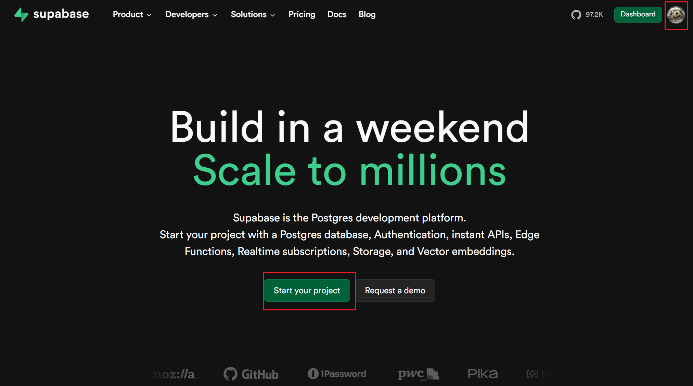

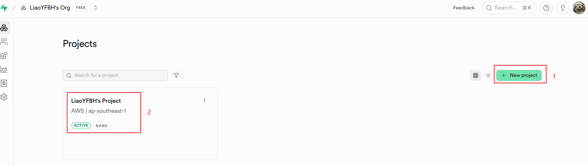

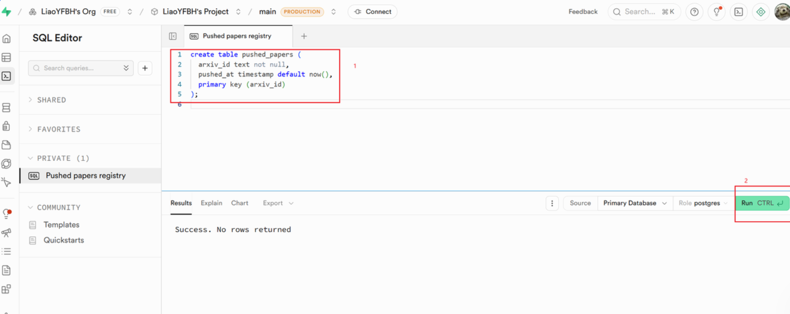

```sql
create table pushed_papers (
  arxiv_id text not null,
  pushed_at timestamp default now(),
  primary key (arxiv_id)
);
```

**在数据库中新建一张用于记录论文推送信息的表**，表名定义为`pushed_papers`，同时为表设置了两个核心字段并添加了数据完整性约束，确保论文推送记录的唯一性和有效性。

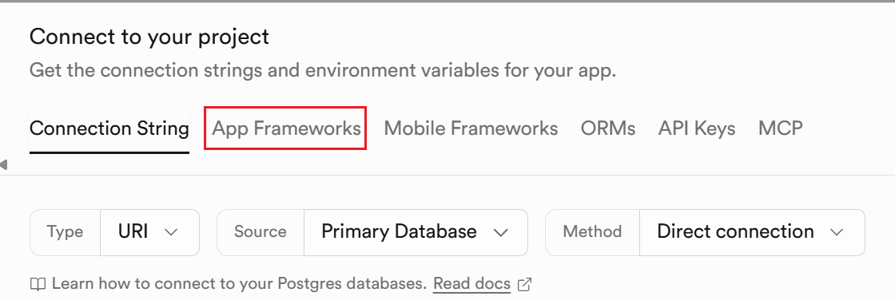


NEXT_PUBLIC_SUPABASE_URL对应dify Supabase插件Supabase URL，NEXT_PUBLIC_SUPABASE_PUBLISHABLE_DEFAULT_KEY对应dify Supabase插件Supabase Key。

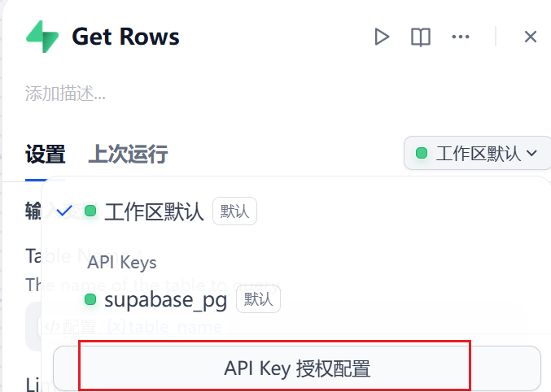


---

## 📊 工作流总体架构

整个工作流的核心流程如下：


### 流程说明

| 阶段 | 节点 | 功能描述 |
|------|------|----------|
| **触发** | 定时触发器 | 每日 2:55 PM (Asia/Shanghai) 自动启动 |
| **配置** | 配置节点 | 读取所有环境变量并输出供后续使用 |
| **翻译** | 条件分支 → LLM翻译 → 汇总 | 根据 API 模式选择星河/文心，翻译研究主题为英文 |
| **搜索** | Get Rows → 搜索论文 | 查询已推送记录，搜索 ArXiv 新论文 |
| **初审** | 条件分支2 → LLM初审 → 汇总 | 使用 LLM 筛选 Top 3 论文 |
| **迭代** | 迭代节点 | 对每篇论文执行：解包→记录→OCR→分析→组装 |
| **输出** | 模板转换 → 邮件发送 | 生成格式化报告并邮件推送 |

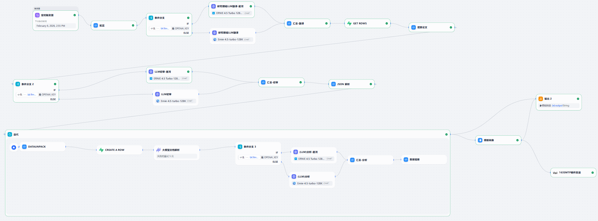
📸 Dify 工作流编辑器全局视图截图，展示完整的节点连接关系


## 🔧 详细搭建步骤

### 第一步：创建工作流

1. 登录 [Dify](https://dify.ai/zh) 平台,或是使用docker启动(补上docker配置的超链接)。

2. 点击「工作室」→ 「创建应用」→ 选择「工作流」类型

   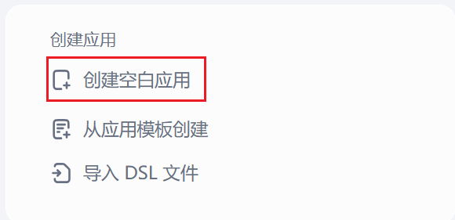

3. 输入应用名称：

   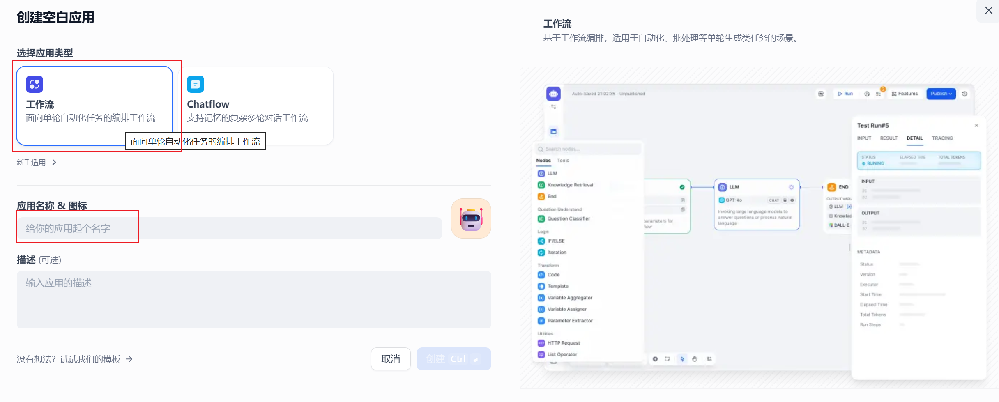

---

### 第二步：配置环境变量

在UI界面右上角点击设置中配置以下环境变量：

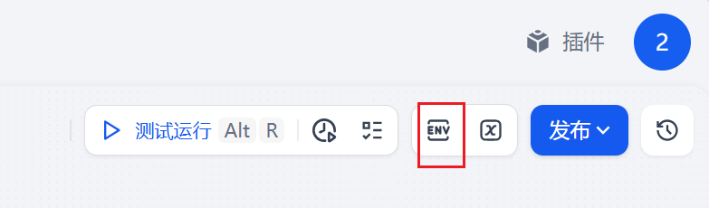

点击添加环境变量：

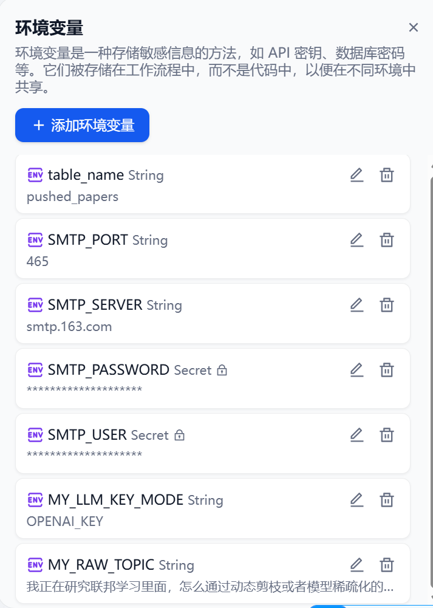

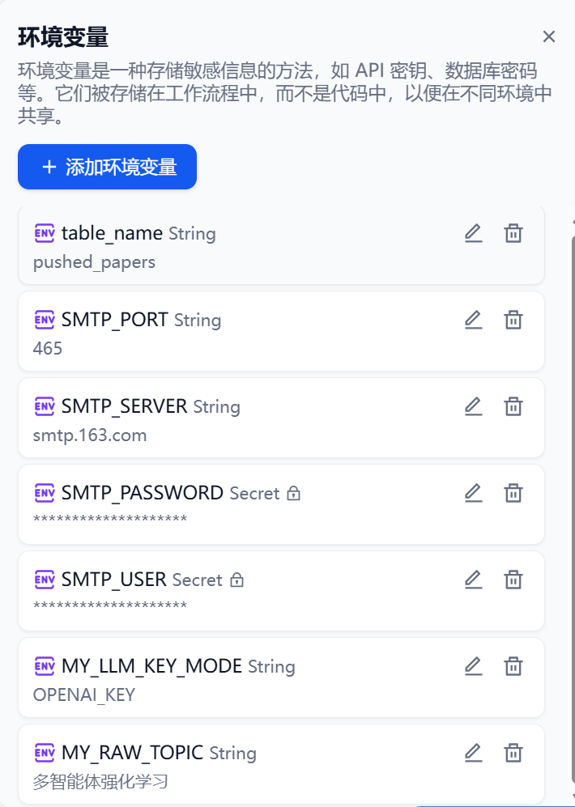

| 变量名 | 类型 | 说明 | 示例值 |
|--------|------|------|--------|
| `table_name` | string | Supabase 表名 | `pushed_papers` |
| `XINGHE_API_KEY` | secret | 星河 API 密钥 | (你的API Key) |
| `SMTP_PORT` | string | 邮箱 SMTP 端口 | `465` |
| `SMTP_SERVER` | string | SMTP 服务器 | `smtp.163.com` |
| `SMTP_PASSWORD` | secret | 邮箱授权码 | (你的授权码) |
| `SMTP_USER` | secret | 邮箱账号 | `your_email@163.com` |
| `MY_LLM_KEY_MODE` | string | LLM 模式选择 | `OPENAI_KEY` |
| `MY_RAW_TOPIC` | string | 研究主题 |

---

### 第三步：定时触发器节点

**节点名称**：`定时触发器`  
**节点类型**：`trigger-schedule`

配置项：
- **触发频率**：每日（daily）

- **时区**：`Asia/Shanghai`

- **触发时间**：`8:59 PM`（或根据需求调整）

  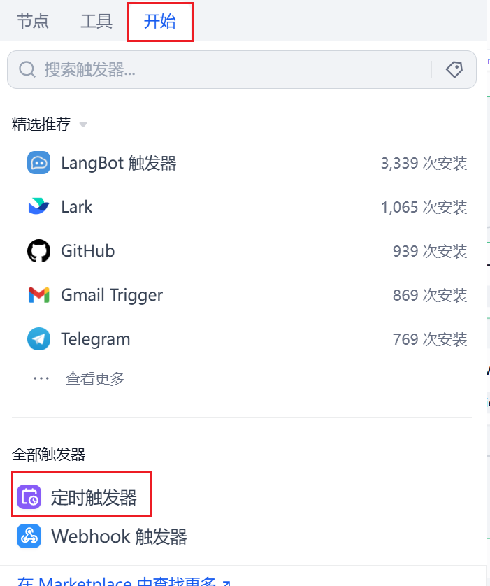


---

### 第四步：配置节点（代码节点）

**节点名称**：`配置`  
**节点类型**：`code`

该节点负责读取所有环境变量并输出供后续节点使用。

**输入变量**：
- 从环境变量读取：`SMTP_PORT`, `SMTP_SERVER`, `SMTP_USER`, `SMTP_PASSWORD`,`MY_LLM_KEY_MODE`, `MY_RAW_TOPIC`, `table_name`

  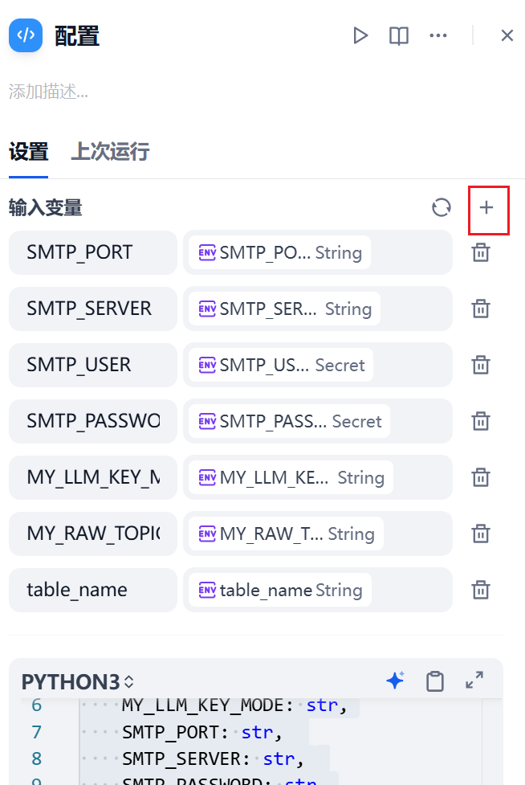

**输出变量**：
- `raw_topic`：研究主题
- `user_email`：接收邮箱
- `MY_LLM_KEY_MODE`：因为千帆和星河社区API接口不兼容，所以用这个控制是否选中星河社区API
- `fetch_count`：搜索论文数量（默认 50）
- `push_limit`：推送数量限制（默认 5）
- `days_lookback`：回溯天数（默认 7）
- 以及 SMTP 相关配置

**代码**：

```python
import os

def main(
    SMTP_USER: str,
    MY_RAW_TOPIC: str,
    MY_LLM_KEY_MODE: str,
    SMTP_PORT: str,
    SMTP_SERVER: str,
    SMTP_PASSWORD: str,
    table_name: str
) -> dict:

    user_email = SMTP_USER
    raw_topic = MY_RAW_TOPIC
    llm_key_mode = MY_LLM_KEY_MODE

    smtp_port = SMTP_PORT
    smtp_server = SMTP_SERVER
    smtp_password = SMTP_PASSWORD
    table_name = table_name

    return {
        # 搜索语句
        "raw_topic": raw_topic,

        # 接收邮箱
        "user_email": user_email,
        "llm_key_mode": llm_key_mode,
    
        # SMTP 配置（供后续邮件节点使用）
        "smtp_port": smtp_port,
        "smtp_server": smtp_server,
        "smtp_password": smtp_password,

        # 其他不敏感的配置
        "fetch_count": 50,
        "push_limit": 5,
        "days_lookback": 7,
        "table_name": table_name
    }
```


---

### 第五步：条件分支节点

**节点名称**：`条件分支`  
**节点类型**：`if-else`

该节点根据 `llm_key_mode` 的值来判断使用哪个 LLM 模型：
- **条件**：`llm_key_mode` = `OPENAI_KEY`
- **True 分支**：使用星河 API
- **False 分支**：使用百度文心 API

> 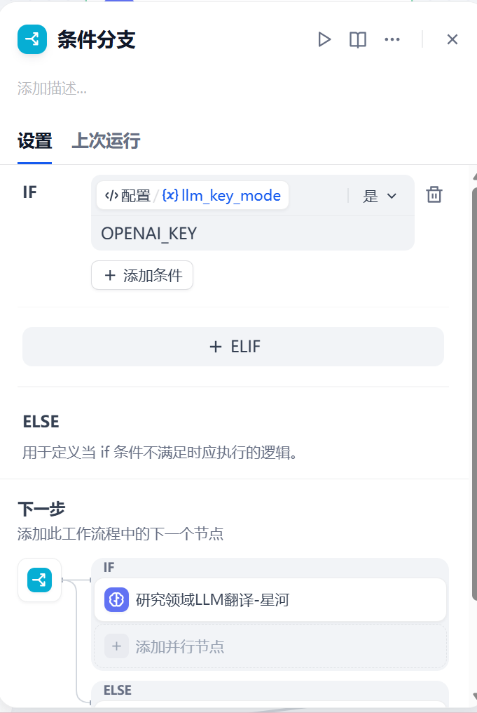

---

### 第六步：研究领域翻译（LLM节点）

**节点名称**：`研究领域LLM翻译`  
**节点类型**：`llm`

将中文研究主题翻译为 ArXiv API 可识别的英文布尔查询字符串。

**模型配置**：

- 模型：`ernie-4.5-turbo-128k`
- 温度：`0.7`

**Prompt 模板**：
```
# Role
你是一个精通 ArXiv 搜索语法的科研助手，擅长从非正式的科研描述中提取核心技术关键词并构建复杂的检索表达式。

# Task
用户的输入可能是一个详细的研究方向描述（中文）{{#1769347686844.raw_topic#}}。你的任务是将其转换为 ArXiv API 效率最高、最精确的 **英文布尔查询字符串**。

# Rules
1. **核心概念提取**：从用户的长描述中识别核心算法（如 Reinforcement Learning）、问题领域（如 Communication Efficiency）和研究对象（如 Multi-Agent Systems）。
2. **术语翻译**：将中文术语准确翻译为学术英语。
3. **布尔逻辑构建**：
   - 使用 `AND` 连接必须同时满足的不同概念维度（例如：研究对象 AND 解决的问题）。
   - 使用 `OR` 连接同义词或高度相关的词，增加搜索覆盖面。
   - 使用双引号 `""` 包裹词组（如 `"multi-agent systems"`）以实现精确匹配。
4. **去噪**：忽略“我正在研究”、“帮我找论文”、“最近的研究”等非学术性的语气词。
5. **只输出结果**：不要包含任何解释、前缀或后缀，只输出构建好的查询字符串。

# Examples
Input: 我想研究基于大模型的多智能体系统的通信开销优化，特别是通过拓扑结构改进来节省 Token 的方法。
Output: ("multi-agent systems" OR "multi-agent collaboration") AND ("communication efficiency" OR "topology optimization" OR "token reduction")

Input: 关注多智能体任务规划中的自我纠错机制，特别是通过辩论或者评论家模型来减少幻觉。
Output: "multi-agent planning" AND ("self-correction" OR "reflexion" OR "debate" OR "critic")

Input: 强化学习智能体在机器人导航中的应用
Output: "reinforcement learning" AND agents AND "robot navigation"

# Input: {{raw_topic}}
```

> 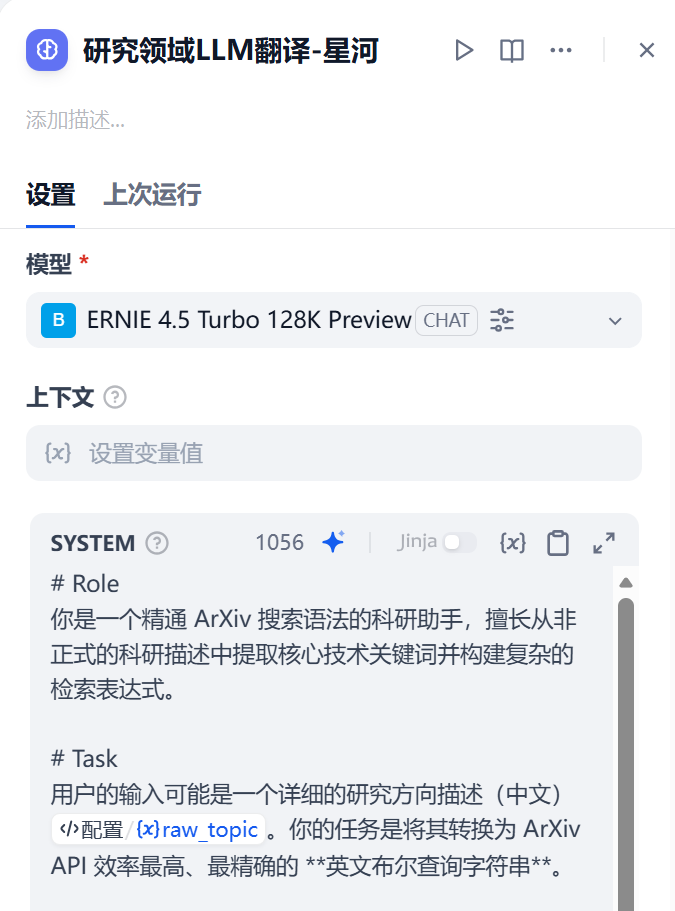

---

### 第七步：查询已推送记录（Supabase节点）

**节点名称**：`Get Rows`  
**节点类型**：`tool` (Supabase)

从 Supabase 数据库查询已推送的论文记录，避免重复推送。

**配置**：
- 表名：`{{table_name}}`（从配置节点获取）

> 

---

### 第八步：搜索论文（代码节点）

**节点名称**：`搜索论文`  
**节点类型**：`code`

该节点通过 ArXiv API 搜索最新论文，并过滤掉已推送的论文。

**核心功能**：
1. 构建 ArXiv API 查询请求
2. 解析 XML 响应
3. 过滤已推送论文
4. 返回新论文列表

**输入变量**：
- `topic`：翻译后的英文搜索词
- `count`：搜索数量
- `days_lookback`：回溯天数
- `supabase_output`：已推送记录

**输出变量**：
- `result`：论文 JSON 列表
- `count`：论文数量
- `cutoff_str`：起始日期
- `today_str`：当前日期
- `debug`：调试信息


> 📸 **[图片占位]** 搜索论文代码节点配置界面截图

---

### 第九步：LLM初审筛选（LLM节点）

**节点名称**：`LLM初审`  
**节点类型**：`llm`

使用 LLM 对论文进行初步评审，筛选出最有价值的论文。

**输出要求**：
- 纯净 JSON 数组格式
- 保留所有原始字段
- 输出 Top 3 论文

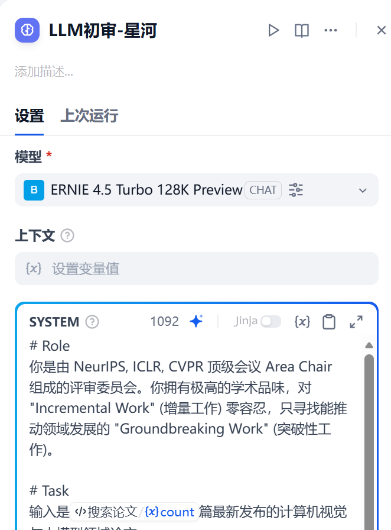
---

### 第十步：JSON解析（代码节点）

**节点名称**：`JSON 解析`  
**节点类型**：`code`

解析 LLM 输出的 JSON 字符串，处理各种可能的格式。

**核心逻辑**：

- 处理嵌套 JSON
- 支持 `papers` 或 `top_papers` 字段
- 容错处理

```python
import json
import re

def main(llm_string) -> dict:
    selected_papers = []

    def try_parse(content):
        """尝试将任意内容解析为 Python 对象"""
        if isinstance(content, dict) or isinstance(content, list):
            return content
        try:
            # 尝试直接解析
            return json.loads(content)
        except:
            # 尝试正则提取 JSON
            match = re.search(r'(\{.*\}|\[.*\])', str(content), re.DOTALL)
            if match:
                try:
                    return json.loads(match.group())
                except:
                    pass
        return None

    try:
        # 第一层解析
        data = try_parse(llm_string)

        # 处理嵌套
        if isinstance(data, dict) and 'text' in data:
            inner_data = try_parse(data['text'])
            if inner_data: 
                data = inner_data
        
        # 归一化
        if isinstance(data, list):
            selected_papers = data
        elif isinstance(data, dict):
            # 优先找 papers 字段
            if 'papers' in data and isinstance(data['papers'], list):
                selected_papers = data['papers']
            elif 'top_papers' in data and isinstance(data['top_papers'], list):
                selected_papers = data['top_papers']
            else:
                for v in data.values():
                    if isinstance(v, list):
                        selected_papers = v
                        break
        
        if not isinstance(selected_papers, list):
            selected_papers = []

    except Exception as e:
        print(f"解析严重失败: {str(e)}")
        selected_papers = []

    return {
        "top_papers": selected_papers,
        "count": len(selected_papers)
    }
```

---

### 第十一步：迭代节点

**节点名称**：`迭代`  
**节点类型**：`iteration`

对筛选后的每篇论文进行迭代处理。

**配置**：

- **输入**：`top_papers`（论文数组）
- **输出**：`merged_paper`（处理后的论文对象）
- **并行模式**：关闭（顺序执行）
- **错误处理**：遇错终止

#### 迭代内部详细流程

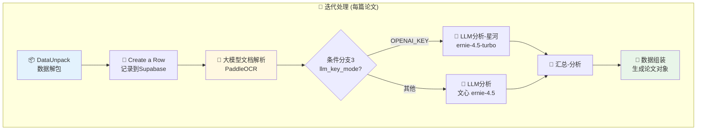
```mermaid
flowchart LR
    subgraph 迭代["🔄 迭代处理 (每篇论文)"]
        direction LR
        A[📦 DataUnpack<br/>数据解包] --> B[💾 Create a Row<br/>记录到Supabase]
        B --> C[📄 大模型文档解析<br/>PaddleOCR]
        C --> D{条件分支3<br/>llm_key_mode?}
        
        D -->|OPENAI_KEY| E1[🌟 LLM分析-星河<br/>ernie-4.5-turbo]
        D -->|其他| E2[🤖 LLM分析<br/>文心 ernie-4.5]
        
        E1 --> F[📝 汇总-分析]
        E2 --> F
        
        F --> G[🔧 数据组装<br/>生成论文对象]
    end
    
    style A fill:#e3f2fd
    style C fill:#fff8e1
    style G fill:#e8f5e9
```

**迭代内节点说明**：

| 序号 | 节点名称 | 类型 | 功能 |
|------|----------|------|------|
| 1 | DataUnpack | code | 将迭代项拆解为独立变量 |
| 2 | Create a Row | tool | 将 arxiv_id 记录到 Supabase 防重复 |
| 3 | 大模型文档解析 | tool | PaddleOCR 解析 PDF 提取正文 |
| 4 | 条件分支3 | if-else | 根据 llm_key_mode 选择模型 |
| 5 | (LLM)分析 / 分析-星河 | llm | 深度分析论文提取关键信息 |
| 6 | 汇总-分析 | code | 合并不同 LLM 的输出结果 |
| 7 | 数据组装 | code | 组装最终的论文对象 |

---

### 迭代内部节点

#### 11.1 DataUnpack（代码节点）

将迭代项拆解为独立变量：

**输出**：
- `title_str`：论文标题
- `pdf_url`：PDF 链接
- `summary_str`：摘要
- `published`：发布日期
- `authors`：作者
- `arxiv_id`：ArXiv ID

代码：

```python
def main(arg1: dict) -> dict:
    """
    DataUnpack: 将迭代项 item (arg1) 拆解为独立的变量
    """
    return {
        "title_str": arg1.get('title', 'No Title'),
        "pdf_url": arg1.get('pdf_url', ''),
        "summary_str": arg1.get('summary', ''),
        "published": arg1.get('published', ''),
        "authors": arg1.get('authors', 'Unknown Authors'),
        "comment": arg1.get('comment', 'N/A'),
        "arxiv_id": arg1.get('arxiv_id', '')
    }
```

---

#### 11.2 Create a Row（Supabase节点）

将论文 ArXiv ID 记录到数据库，防止重复推送。

**配置**：
- 表名：从配置节点获取

- 数据：`{"arxiv_id": "{{arxiv_id}}"}`

  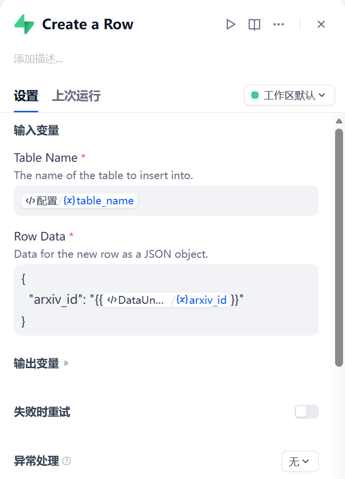

#### 11.3 大模型文档解析（PaddleOCR节点）

**节点名称**：`大模型文档解析`  
**节点类型**：`tool` (PaddleOCR)

使用 PaddleOCR 解析论文 PDF，提取正文内容。

**配置**：
- `file`：PDF URL
- `fileType`：0（PDF 文件）
- `useLayoutDetection`：true（启用版面检测）
- `prettifyMarkdown`：true（美化输出）

> 

---

#### 11.4 条件分支3

根据 LLM 模式选择使用星河 API 还是文心 API。

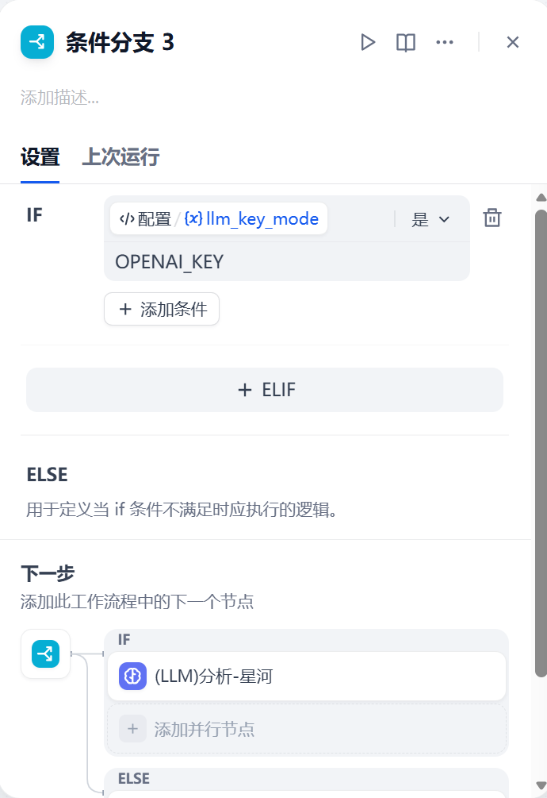

---

#### 11.5 LLM深度分析

**节点名称**：`(LLM)分析`  
**节点类型**：`llm`

对论文进行深度分析，提取关键信息。

**提取字段**：
1. **One_Liner**：一句话痛点与解决方案
2. **Architecture**：模型架构与关键创新点
3. **Dataset**：数据来源与规模
4. **Metrics**：核心性能指标
5. **Chinese_Abstract**：中文摘要翻译
6. **Affiliation**：作者机构
7. **Code_Url**：代码链接

**核心原则**：
- 拒绝废话：直接说具体方法
- 深挖细节：总结算法逻辑、损失函数设计
- 数据优先：展示对比 SOTA 的提升幅度
- 禁止 N/A：合理推断

**输出格式**：纯 JSON 对象

> 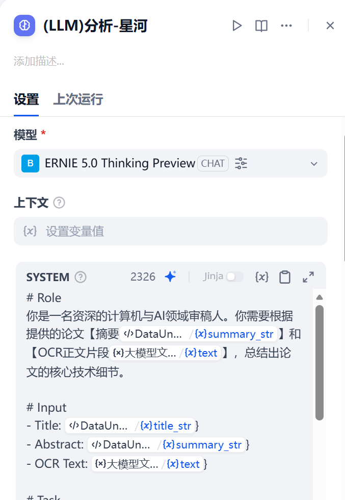

---

#### 11.6 汇总-分析（代码节点）

根据 LLM 模式合并不同 LLM 的输出结果。

代码：

```python
def main(arg1: str, arg2: str, llm_key_mode: str) -> dict:
    if llm_key_mode == "OPENAI_KEY":
        return {
            "result": arg1
        }
    else:
        return {
            "result": arg2
        }
```


---

#### 11.7 数据组装（代码节点）

**节点名称**：`数据组装`  
**节点类型**：`code`

将所有信息组装成结构化的论文对象。

**核心功能**：
1. 解析发布状态（识别顶会论文）
2. 解析 LLM 输出的 JSON（处理深度思考模型的 `<think>` 标签）
3. 提取代码链接
4. 组装最终论文对象

**输出字段**：
- `title`：标题
- `authors`：作者
- `affiliation`：机构
- `pdf_url`：PDF 链接
- `summary`：英文摘要
- `published`：发布状态
- `github_stats`：代码状态
- `code_url`：代码链接
- `ai_evaluation`：AI 分析结果

```jinja2
📅 PaperEssence 科研日报
根据您指定的研究内容“{{ raw_topic }}”，每天推送arxiv近7日天更新论文中挑选的3篇论文。
--------------------------------------------------
<small><i>⚠️ 注：内容由 AI 生成，仅供学术参考。请在引用或深入研究前，务必点击 PDF 链接查阅原始论文进行核实。</i></small>
生成日期: {{ items.target_date | default('Today') }}
==================================================

{# 自动适配数据结构 #}



📄 [{{ loop.index }}] {{ item.title }}
--------------------------------------------------
👤 作者: {{ item.authors }}
🏢 机构: {{ item.affiliation }}
🔗 PDF: {{ item.pdf_url }}
📅 状态: {{ item.published }}

📦 Code: {{ item.github_stats }}
   🔗 {{ item.code_url }}

📦 Code: {{ item.github_stats }}

English Abstract:
{{ item.summary | replace('\n', ' ') }}

中文摘要:
{{ item.ai_evaluation.Chinese_Abstract }}

🚀 核心创新:
{{ item.ai_evaluation.One_Liner }}

📊 总结:
{# 利用换行和缩进制造层级感，不依赖 HTML 标签 #}
--------------------------------------------------
🏗️ 架构:
{{ item.ai_evaluation.Architecture | replace('\n- ', '\n\n   🔹 ') | replace('- ', '   🔹 ') }}

💾 数据:
{{ item.ai_evaluation.Dataset | replace('\n- ', '\n\n   🔹 ') | replace('- ', '   🔹 ') }}

📈 指标:
{{ item.ai_evaluation.Metrics | replace('\n- ', '\n\n   🔹 ') | replace('- ', '   🔹 ') }}

==================================================

⚠️ 今日无新论文更新。

```


---

### 第十二步：模板转换

**节点名称**：`模板转换`  
**节点类型**：`template-transform`

使用 Jinja2 模板将论文数据转换为格式化的邮件内容。

**模板结构**：

```jinja2
📅 PaperEssence 科研日报
根据您指定的研究内容“{{ raw_topic }}”，每天推送arxiv近7日天更新论文中挑选的3篇论文。
--------------------------------------------------
<small><i>⚠️ 注：内容由 AI 生成，仅供学术参考。请在引用或深入研究前，务必点击 PDF 链接查阅原始论文进行核实。</i></small>
生成日期: {{ items.target_date | default('Today') }}
==================================================

{# 自动适配数据结构 #}



📄 [{{ loop.index }}] {{ item.title }}
--------------------------------------------------
👤 作者: {{ item.authors }}
🏢 机构: {{ item.affiliation }}
🔗 PDF: {{ item.pdf_url }}
📅 状态: {{ item.published }}

📦 Code: {{ item.github_stats }}
   🔗 {{ item.code_url }}

📦 Code: {{ item.github_stats }}

English Abstract:
{{ item.summary | replace('\n', ' ') }}

中文摘要:
{{ item.ai_evaluation.Chinese_Abstract }}

🚀 核心创新:
{{ item.ai_evaluation.One_Liner }}

📊 总结:
{# 利用换行和缩进制造层级感，不依赖 HTML 标签 #}
--------------------------------------------------
🏗️ 架构:
{{ item.ai_evaluation.Architecture | replace('\n- ', '\n\n   🔹 ') | replace('- ', '   🔹 ') }}

💾 数据:
{{ item.ai_evaluation.Dataset | replace('\n- ', '\n\n   🔹 ') | replace('- ', '   🔹 ') }}

📈 指标:
{{ item.ai_evaluation.Metrics | replace('\n- ', '\n\n   🔹 ') | replace('- ', '   🔹 ') }}

==================================================

⚠️ 今日无新论文更新。

```

> 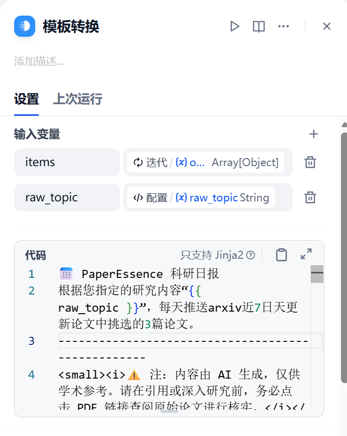

---

### 第十三步：邮件发送

**节点名称**：`163SMTP邮件发送`  
**节点类型**：`tool` (163-smtp-send-mail)

**配置**：
- `username_send`：发件人邮箱（从环境变量读取）
- `authorization_code`：邮箱授权码（从环境变量读取）
- `username_recv`：收件人邮箱
- `subject`：`PaperEssence-{{cutoff_str}}-{{today_str}}`
- `content`：模板转换后的内容

> 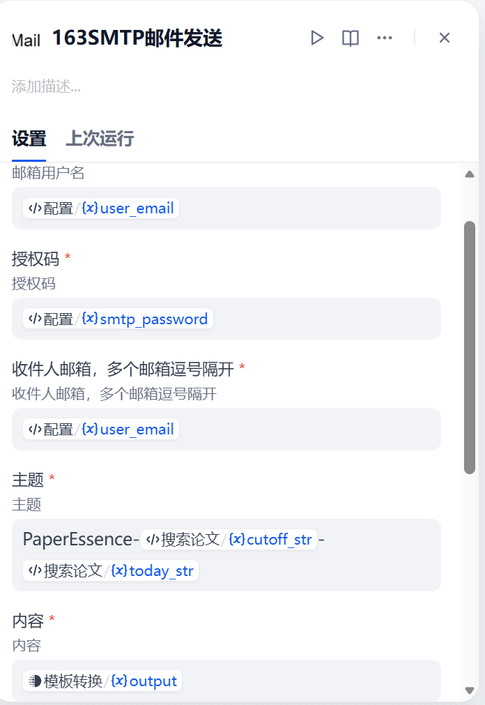

---

### 第十四步：输出节点

**节点名称**：`输出 2`  
**节点类型**：`end`

输出最终结果，便于调试和验证。

> 

---

### 获取工作流 API 信息

等workflow调试通之后，

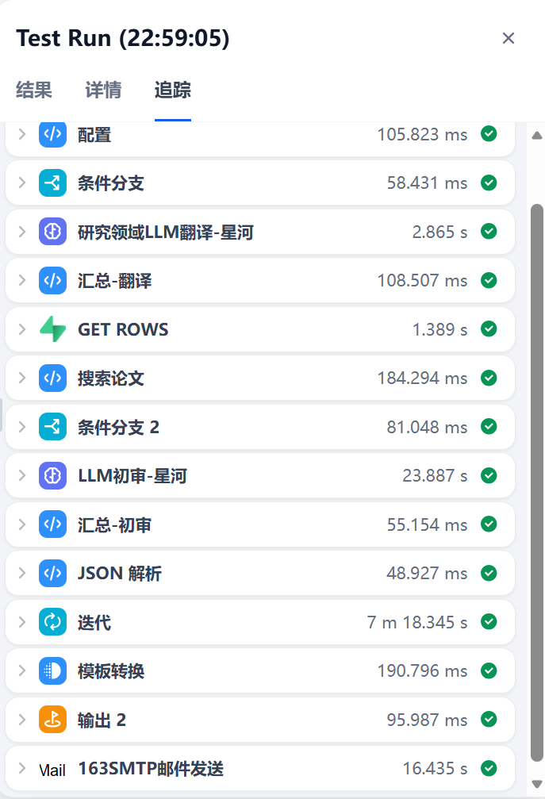

点击右上角发布：

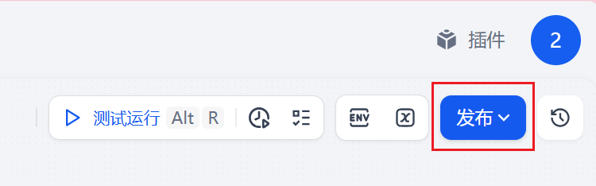

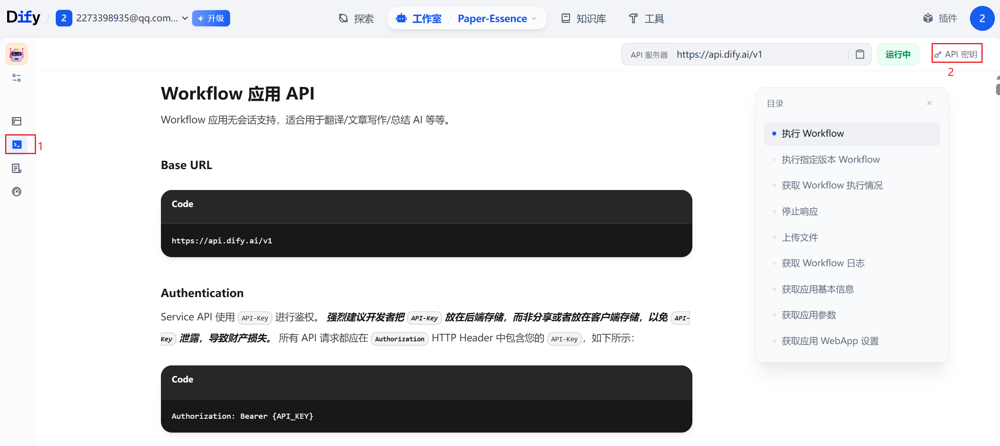

记录以下信息：

- **API 端点**：`https://api.dify.ai/v1/workflows/run`（或你的私有部署地址）
- **API 密钥**：形如 `app-xxxxxxxxxxxx` 的字符串

## ⏰ 配置每天自动运行

由于 Dify 云端平台的定时触发器在免费版可能存在限制，我们可以使用 Windows 任务计划程序配合脚本来实现每日定时触发工作流。

### 前置条件：安装 Git for Windows

本方案使用 Git Bash 执行 curl 命令，因此需要先安装 Git for Windows。

📥 **下载地址**：[https://git-scm.com/downloads/win](https://git-scm.com/downloads/win)

安装时注意：
- 建议选择默认安装路径（如 `C:\Program Files\Git`）或自定义路径（如 `D:\ProgramFiles\Git`）
- 安装选项中确保勾选 "Git Bash Here"

### 配置 Windows 任务计划程序

1. 按下 `Win + R` → 输入 `taskschd.msc`，回车，打开任务计划程序
2. 点击右侧「创建任务」

#### 常规标签：
- **名称**：`Paper-Essence Daily Run`
- 勾选「使用最高权限运行」

#### 触发器标签：
1. 点击「新建」
2. 「开始任务」下拉框选择「按预定计划」
3. 选择「每天」，设置触发时间（建议与 Dify 工作流中的定时器时间一致，如 `20:55`）
4. 点击「确定」

#### 操作标签：
1. 点击「新建」
2. 操作选择「启动程序」
3. **程序或脚本**：输入你的 Git Bash 路径，例如：
   ```
   D:\ProgramFiles\Git\bin\bash.exe
   ```
   或默认安装路径：
   ```
   C:\Program Files\Git\bin\bash.exe
   ```
4. **添加参数**：
   ```
   -c "curl -s -X POST 'https://api.dify.ai/v1/workflows/run' -H 'Authorization: Bearer app-你的API密钥' -H 'Content-Type: application/json' -d '{\"inputs\": {}, \"response_mode\": \"streaming\", \"user\": \"scheduled-task\"}'"
   ```
   
   > ⚠️ **注意**：将 `app-你的API密钥` 替换为你实际的 API 密钥


#### 条件标签（可选）：
- 可以取消勾选「只有在计算机使用交流电源时才启动此任务」，确保笔记本电脑在电池模式下也能执行

#### 设置标签（可选）：
- 勾选「如果任务失败，按以下频率重新启动」，可设置重试间隔

5. 点击「确定」保存任务


## 🧪 测试与调试

### 手动测试

1. 点击工作流编辑器右上角的「运行」按钮
2. 观察每个节点的执行状态
3. 检查各节点的输出是否符合预期

### 成功运行效果

当工作流成功执行后，你将在邮箱中收到如下格式的论文日报邮件：

> 

